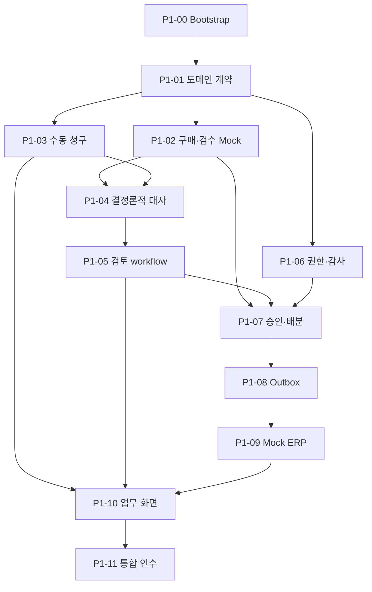

# Invoice Match 구현 계획

문서 상태: **Phase 1 착수 기준선**  
작성일: **2026-09-25**  
기준 문서: [`Spec.md` 1.1-confirmed](./Spec.md)  
실행 방법: [`Implement.md`](../Implement.md)

업무 범위, 용어, 상태, 불변식과 책임 경계는 `Spec.md`를 따른다. 이 문서는 Phase별 목표, Phase 1 Ticket, 의존성과 검증 기준만 정의한다. 각 Ticket에 반복한 규칙은 작업자가 그 Ticket만 읽고 안전하게 실행하도록 발췌한 계약이며, 별도의 원본 정의가 아니다.

## 1. Phase 1~5 로드맵

| Phase | 목표 | 핵심 산출물 | 완료 기준 |
|---|---|---|---|
| 1 — AI 없는 업무 코어 | 수동 입력으로 핵심 업무 불변식과 끝단 흐름 검증 | Spring core, PostgreSQL, 구매 Mock, 결정론적 대사, 검토/RBAC/감사, 동시 배분, 지급요청 Outbox, Mock ERP, 얇은 Next.js UI | 정상·5개 예외·보완·거절·승인·인계를 재현하고 동시 승인에서도 초과 배분 0건 |
| 2 — 문서와 비동기 처리 | 파일 접수와 느린 작업·외부 장애 격리 | MinIO, presigned upload, PDF/Excel parser, AnalysisRun, RabbitMQ, retry/DLQ, 운영 화면 | worker/broker 중단과 중복 메시지에도 사건 유실·업무 중복 없음 |
| 3 — AI 추출·매핑·근거 | 비정형 해석을 구조화하고 품질 측정 | Document/Item Mapping/Evidence/Resolution agent, 읽기 전용 도구, pgvector, schema validation, 평가셋 | 비-AI 기준선 대비 품질·비용·지연·실패 유형 제시 |
| 4 — Human-in-the-loop | 사람 대기와 재개를 안전하게 모델링 | LangGraph checkpoint, mapping interrupt, 새 증빙 재분석, resume 멱등성, stale 차단 | worker/message 점유 없이 정확한 version만 재개·반영 |
| 5 — 최적화·장애 시연·포트폴리오 | 측정 가능한 개선과 재현 가능한 설명 완성 | 조회·인덱스 실험, 부하·경합·장애 주입, ERP 대사, 관측성, README/ERD/보고서 | 5~7분 시연, Docker Compose 재현, 성능·AI 평가 결과와 trade-off 설명 |

Phase 2~5의 Ticket은 직전 Phase 완료 검토 후 상세화한다.

## 2. Phase 1 Backlog

### P1-00 — 저장소와 실행 기준선

**목적과 범위:** Git 저장소, Java 21 Spring Boot 3 `core-api`, Next.js TypeScript `web`, PostgreSQL, Mock ERP의 실행 골격과 Docker Compose/CI를 만든다. AI worker, MinIO, RabbitMQ는 제외한다.

**관련 규칙/불변식:** Spring은 단일 애플리케이션의 package-by-feature 구조로 시작한다. secret을 커밋하지 않으며 시각은 UTC로 저장한다.

**Acceptance Criteria:** 문서화된 명령으로 core, web, postgres, mock-erp가 기동되고 health check, lint, test, build가 통과한다.

**테스트/검증:** clean build, Compose smoke, DB 연결, CI 최소 pipeline.

**의존성:** 없음.

**사람 확인:** README만 보고 새 터미널에서 실행 가능한지, 구조를 2분 안에 설명할 수 있는지 확인한다.

### P1-01 — 도메인 계약과 DB 기준선

**목적과 범위:** 상태 전이, 식별자, 금액/수량 type과 `InvoiceCase`, draft revision, `EvidenceBundle`, `InvoiceLine`, `MatchResult`, `ReviewSnapshot`, `ReviewDecision`의 최소 schema를 구현한다.

**관련 규칙/불변식:** 원 단위 KRW와 정수 수량을 사용한다. 한 사건은 한 공급사·한 발주만 참조한다. 제출된 증빙 묶음과 검토 결정은 수정하지 않는다.

**Acceptance Criteria:** 잘못된 상태 전이와 값이 거부되고, 사건 optimistic version과 migration이 존재하며 entity를 API로 직접 직렬화하지 않는다.

**테스트/검증:** 상태 전이 parameterized test, PostgreSQL migration test, 금액 경계값 test.

**의존성:** P1-00.

**사람 확인:** `Spec.md`의 용어·상태·불변식과 schema가 일치하는지 확인한다.

### P1-02 — 구매·검수 Mock과 로컬 Snapshot

**목적과 범위:** 외부 구매시스템 Mock API, read-only adapter, PO/검수 snapshot과 external version 동기화를 구현한다.

**관련 규칙/불변식:** 외부 Mock은 발주·검수 사실의 정본이고 `ReceiptAllocation`은 이 시스템에서 소비한 수량의 정본이다. 오래된 외부 version이 최신 snapshot을 덮어쓰지 않는다.

**Acceptance Criteria:** PO, 공급사, 품목, 검수와 version을 조회·동기화하고 부재·불일치·미확정을 구분한다. 같은 version refresh는 멱등하다.

**테스트/검증:** API 계약, version 역행, timeout, 잘못된 payload, 반복 refresh 통합 test.

**의존성:** P1-01.

**사람 확인:** 외부 검수량과 로컬 사용량이 화면·로그·문서에서 명확히 구분되는지 확인한다.

### P1-03 — 수동 청구와 증빙 묶음 Versioning

**목적과 범위:** 사건 생성, draft 편집, 제출, 보완 후 다음 revision 작성/제출 API와 request-id 멱등 처리를 구현한다.

**관련 규칙/불변식:** draft만 수정할 수 있다. 제출 시 수동 입력을 수정 불가능한 `EvidenceBundle vN`으로 동결하며 보완은 vNext로 만든다.

**Acceptance Criteria:** header/line 작성과 제출, bundle version/hash 생성, 제출 후 수정 차단, 보완 재제출, 과거 version 조회가 가능하다. 같은 requestId의 다른 payload는 conflict다.

**테스트/검증:** validation/idempotency, v1→보완→v2 보존, 동시 draft 수정 test.

**의존성:** P1-01, P1-02의 PO 조회 계약.

**사람 확인:** 제출 값을 조용히 덮어쓰는 경로가 없는지, 보완 전후 차이를 읽을 수 있는지 확인한다.

### P1-04 — 결정론적 3-way 대사

**목적과 범위:** 품목/PO line, 단가, 청구수량, 검수 잔량을 비교해 결과와 계산 근거, 예상 배분계획을 만든다.

**관련 규칙/불변식:** 허용오차 0, 잔량 이하 부분 청구 허용, 복수 검수 FIFO 배분, AI 미사용, 업무상 중복과 기술적 멱등성 분리를 지킨다.

**Acceptance Criteria:** 정상, 수량 초과, 단가 차이, 품목 미확정, 번호 중복, 근거 부족과 복수 예외를 재현하며 같은 입력은 같은 결과/hash를 만든다.

**테스트/검증:** table-driven test, 배분 합계·잔량 비초과 property test, 잔량 경계와 단가 1원 차이 test.

**의존성:** P1-02, P1-03.

**사람 확인:** 예외 설명을 입력값으로 재계산할 수 있고 FIFO가 V1 정책으로 표시되는지 확인한다.

### P1-05 — 검토·매핑·보완·거절

**목적과 범위:** 품목 매핑 확정, 재대사, 보완요청, 거절, 승인용 `ReviewSnapshot`과 canonical hash를 구현한다.

**관련 규칙/불변식:** 매핑은 현재 사건에만 적용한다. source bundle, 대사 결과, 매핑, 예상 배분, 금액을 snapshot에 포함하며 source 변경 시 stale 처리한다.

**Acceptance Criteria:** 미확정 품목을 사람이 확정해 재대사하고, 보완/거절 사유를 기록하며, stale snapshot으로 승인할 수 없다.

**테스트/검증:** 매핑 전후 결과, bundle/mapping 변경 후 stale, 잘못된 상태 action test.

**의존성:** P1-04.

**사람 확인:** 승인 화면의 사실과 hash 대상 payload가 동일하며 AI 없이도 판단 근거를 이해할 수 있는지 확인한다.

### P1-06 — 역할 권한과 감사이력

**목적과 범위:** `SUBMITTER`, `APPROVER`, `OPERATOR` 역할, 로컬 시연 사용자, action 권한과 append-only 감사이력을 구현한다.

**관련 규칙/불변식:** 제출자의 자기 승인을 금지한다. 감사이력은 actor, action, 대상 version, 의미 있는 변경, request/trace ID를 포함하며 비밀정보를 남기지 않는다.

**Acceptance Criteria:** 역할별 허용/거부가 적용되고 자기 승인은 차단된다. 제출·매핑·보완·거절·승인·revision·재처리 이력이 남는다.

**테스트/검증:** 권한 matrix, 자기 승인, 비인증 접근, 감사 이벤트 누락/민감정보 test.

**의존성:** P1-01. P1-03~05와 계약 고정 후 병렬 통합 가능.

**사람 확인:** 정산 담당자와 승인자의 action이 실제로 구분되고 감사 diff가 업무적으로 읽히는지 확인한다.

### P1-07 — 원자적 승인과 동시 배분

**목적과 범위:** 최신 ReviewSnapshot 승인과 `ReceiptAllocation`, `ReviewDecision`, `PaymentRequest` 생성을 한 트랜잭션으로 구현한다.

**관련 규칙/불변식:** 사건/bundle/snapshot/external receipt version과 권한을 재검증한다. 검수 행을 고정 순서로 잠그고 전체 라인 성공 시에만 배분한다. 외부 호출 중 잠금을 유지하지 않는다.

**Acceptance Criteria:** 정상 승인은 정확한 배분과 지급요청 하나를 만든다. 잔량 60에 40+40 동시 승인 시 한 건만 성공하며 stale/중복 요청은 side effect 없이 실패한다.

**테스트/검증:** 실제 PostgreSQL 동시성 반복 test, rollback 주입, 같은 requestId 병렬 승인 test.

**의존성:** P1-02, P1-05, P1-06.

**사람 확인:** 두 번째 승인 실패 이유가 최신 잔량과 함께 표시되고 HTTP 호출이 잠금 범위 밖인지 확인한다.

### P1-08 — 지급요청과 최소 Transactional Outbox

**목적과 범위:** 승인 트랜잭션의 PaymentRequest/Outbox 저장과 pending event를 Mock ERP HTTP adapter로 전달하는 인프로세스 relay를 구현한다.

**관련 규칙/불변식:** 외부 지급요청 key는 유일하며 전달은 at-least-once일 수 있다. timeout은 실패 확정이 아니며 `RESULT_UNKNOWN`은 자동 blind resend하지 않는다.

**Acceptance Criteria:** relay 중단에도 event가 남고 중복 실행에도 지급요청이 늘지 않는다. 4xx와 timeout을 구분하고 relay 선점을 조건부 update/lease로 보호한다.

**테스트/검증:** commit 직후 중단, HTTP 성공 후 상태 변경 전 중단, 중복 relay, 선점 경합 test.

**의존성:** P1-07.

**사람 확인:** Outbox가 범용 프레임워크로 팽창하지 않고 exactly-once를 과장하지 않는지 확인한다.

### P1-09 — Mock ERP와 Webhook 멱등성

**목적과 범위:** idempotency key 기반 지급요청 수신, ACK/후속 webhook, signature/event/payment key 검증을 구현한다.

**관련 규칙/불변식:** 같은 key+같은 payload는 기존 결과, 다른 payload는 conflict다. webhook event는 한 번만 반영하며 unknown 결과에서 새 지급요청을 만들지 않는다.

**Acceptance Criteria:** 정상 인계 후 `EXPORTED/ACKNOWLEDGED`가 되고, 중복 요청·webhook에도 논리 지급요청은 하나다. 응답 유실과 위조/역순 event를 재현한다.

**테스트/검증:** 소비자 주도 계약, 중복/conflict/위조/역순/unknown key, 응답 유실 test.

**의존성:** P1-08, P1-06.

**사람 확인:** Mock ERP의 실제 레코드 수가 하나이며 `FAILED`와 `RESULT_UNKNOWN`이 구분되는지 확인한다.

### P1-10 — 조회 API와 최소 업무 화면

**목적과 범위:** 로그인, 사건 목록, 수동 작성, 3-way 비교, 매핑, 보완, 거절, 승인, 인계상태, 감사이력 화면을 구현한다.

**관련 규칙/불변식:** 서버 계산을 UI가 재판정하지 않는다. 표시한 version/hash로 승인하며 stale/경합 후 최신 상세와 원인을 표시한다.

**Acceptance Criteria:** 브라우저에서 정상·예외·보완·거절·승인 흐름과 자기 승인 금지를 재현하며 PO/검수/청구와 계산 근거를 비교할 수 있다.

**테스트/검증:** API schema/typecheck, Playwright happy/supplement/reject/self-approval/stale E2E, console/viewport 확인.

**의존성:** P1-03~P1-09 API 계약. Mock contract로 일부 병렬 진행 가능.

**사람 확인:** 5~7분 시연 흐름, 접근성 기본 동작, Phase 1에 가짜 AI/원문 미리보기가 없는지 확인한다.

### P1-11 — Phase 1 통합 인수

**목적과 범위:** 전체 Ticket을 통합하고 반복 가능한 fixture, E2E, 경합·장애 시연과 Phase 2 입력 계약을 확정한다.

**관련 규칙/불변식:** 기대 결과는 구현과 독립된 사건 예제로 정의한다. flaky retry로 실패를 감추지 않으며 미구현 AI/문서/RabbitMQ를 완료로 주장하지 않는다.

**Acceptance Criteria:** 정상 승인, 60/100 보완 후 재제출, 단가 차이, 품목 매핑, 번호 중복, 근거 부족, 40+40 경합, ERP 응답 유실을 재현한다. 전체 test/build/smoke와 ADR/ERD/API/runbook이 최신이다.

**테스트/검증:** JUnit+Testcontainers, Playwright, 반복 동시성, 장애 주입, clean Compose smoke.

**의존성:** P1-00~P1-10.

**사람 확인:** 5~7분 실제 시연과 화이트보드 설명을 수행하고 Phase 2에서 유지할 contract를 확인한다.

## 3. Ticket 의존성

