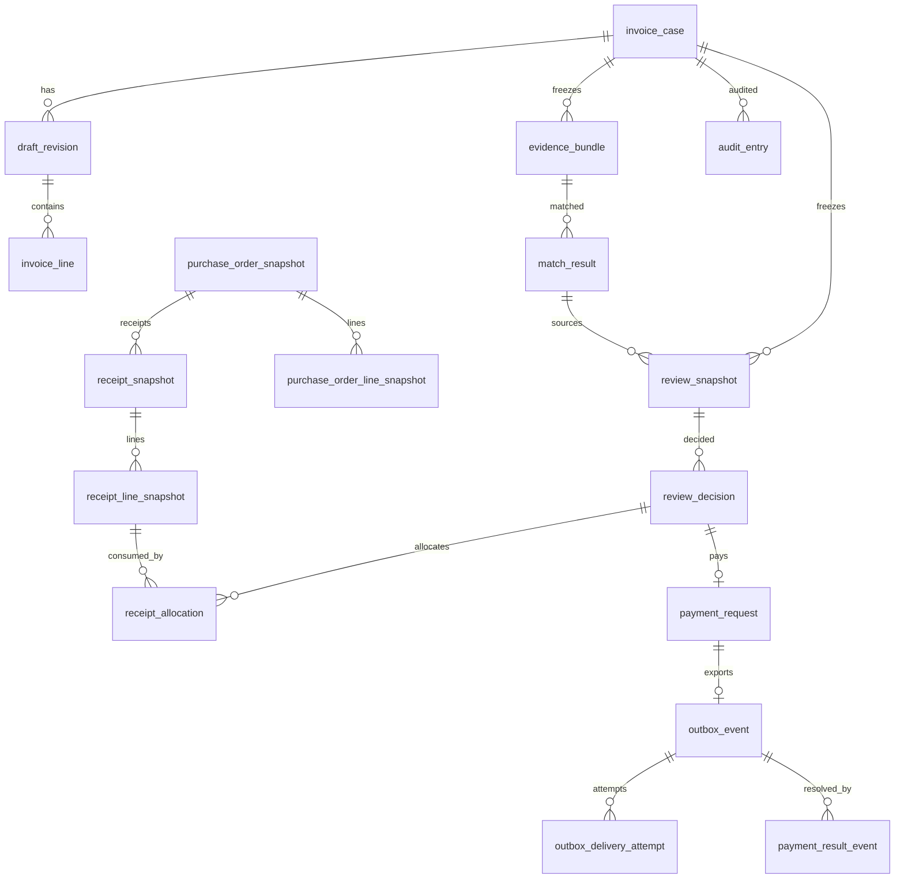

# ERD — Phase 1 PostgreSQL schema

This is the current Phase 1 schema map. The authoritative DDL is the Flyway
migration set `core-api/src/main/resources/db/migration/V1__…` … `V9__…`; this
document is a navigational summary, not a second source of truth. Column lists
name the business columns and the migrated ones (for example `match_result`
gains `result_number`, `purchasing_snapshot_version`, `purchasing_snapshot_hash`
and `mapping_watermark` in `V4`/`V5`; `review_decision` gains
`decision_number` in `V5` and the approval metadata in `V7`).

## Feature groups

| Migration | Feature |
| --- | --- |
| `V1__invoice_case_domain_baseline` | Invoice case, draft revision, invoice line, evidence bundle, match result, review snapshot/decision |
| `V2__purchasing_reference_snapshot` | External purchasing reference snapshot |
| `V3__invoice_case_manual_submission` | Manual submission / sealed draft and evidence versioning |
| `V4__deterministic_matching` | Deterministic match result append + result number |
| `V5__review_workflow` | Review snapshot/decision, mapping, freshness, purchasing/mapping watermarks |
| `V6__roles_audit_identity` | Actor-scoped idempotency, `submitted_by`, append-only audit |
| `V7__atomic_approval_and_allocation` | Receipt allocation, APPROVED decision metadata, payment request |
| `V8__payment_export_outbox` | Outbox event, delivery-attempt ledger, payment `export_version` |
| `V9__payment_result_webhook` | External result event, unknown-result resolution |

## Table map

| Table | Primary key | Important columns | Key relationships |
| --- | --- | --- | --- |
| `invoice_case` | `id` uuid | `supplier_id`, `purchase_order_id`, `invoice_number`, `normalized_invoice_number`, `status`, `current_draft_revision_id`, `version`, `submitted_by`, timestamps | → `draft_revision` (current); `supplier_id`/`purchase_order_id` are **logical external references (no FK)**; current facts live in `purchase_order_snapshot` keyed by `purchase_order_id` |
| `draft_revision` | `id` uuid | `revision_number`, `status` (`OPEN`/`SEALED`), `sealed_at` | → `invoice_case` |
| `invoice_line` | `id` uuid | `line_number`, `raw_item_name`, `quantity`, `unit_price`, `confirmed_item_id` | → `invoice_case`, → `draft_revision` |
| `evidence_bundle` | `id` uuid | `version_number`, `payload_hash`, `payload` jsonb, `submitted_at` | → `invoice_case`, → sealed `draft_revision`; append-only |
| `match_result` | `id` uuid | `result_number`, `result_hash`, `payload` jsonb, `purchasing_snapshot_version`, `purchasing_snapshot_hash`, `mapping_watermark` | → `invoice_case`, → `evidence_bundle`; append-only |
| `review_snapshot` | `id` uuid | `snapshot_number`, `match_result_number`, `target_case_version`, `target_evidence_bundle_version`, `purchasing_snapshot_version`, `purchasing_snapshot_hash`, `mapping_watermark`, `payload_hash`, `payload` jsonb | → `invoice_case`, → `evidence_bundle`, → `match_result`; append-only approval subject (ADR 0001) |
| `review_decision` | `id` uuid | `decision_number`, `decision`, `decided_by`, `reason`, `decision_payload`, `payload_hash`, mapping columns (`mapping_bundle_id`, `mapping_line_number`, `mapping_item_id`, `mapping_po_line_id`), approval columns (`approved_amount`, `approved_currency`, `approved_case_version_before/after`, `approval_actor_roles`, `approval_request_id`, `approval_trace_id`) | → `invoice_case`, → `review_snapshot`; append-only |
| `receipt_allocation` | `id` uuid | `purchase_order_id` (logical external id), `invoice_line_number`, `receipt_id`, `receipt_line_id`, `receipt_line_version`, `confirmed_quantity_at_approval`, `allocated_quantity` | composite FK to `invoice_case`+`purchase_order_id`+APPROVED `review_decision` subject, → `receipt_line_snapshot`; append-only, over-allocation trigger |
| `payment_request` | `id` uuid | `purchase_order_id` (logical external id), `external_request_key`, `amount`, `currency`, `status`, `export_version` | composite FK to `invoice_case`+`purchase_order_id`+`review_decision`(subject + amount), → `review_snapshot`; one per approval |
| `outbox_event` | `id` uuid | `event_type`, `export_version`, `idempotency_key`, `payload`, `payload_hash`, `status`, `attempt_count`, `next_attempt_at`, `worker_id`, `claim_token`, `lease_expires_at`, `last_error_code`, `delivered_at` | → `payment_request`, → `invoice_case`; unique `idempotency_key = paymentRequestId:exportVersion` |
| `outbox_delivery_attempt` | `id` uuid | `attempt_number`, `outcome`, `http_status`, `error_code`, `detail` | → `outbox_event`, → `payment_request`; append-only attempt evidence |
| `payment_result_event` | `id` uuid | `provider`, `external_event_id`, `external_payment_key`, `outcome`, `payload_hash`, `external_reference` | → `payment_request`, → `outbox_event`; unique `(provider, external_event_id)`; append-only |
| `idempotency_record` | `id` uuid | `scope`, `resource_key`, `actor`, `request_id`, `request_hash`, `response_status`, `response_body` | unique actor-scoped `(scope, resource_key, actor, request_id)` |
| `audit_entry` | `id` uuid | `occurred_at`, `actor`, `actor_roles`, `action`, `target_type`, `target_id`, `business_version`, `before_state` jsonb, `after_state` jsonb, `request_id`, `trace_id` | → `invoice_case`; append-only (no `UPDATE`/`DELETE`) |
| `purchase_order_snapshot` | `purchase_order_id` | `supplier_id`, `supplier_name`, `status`, `snapshot_version`, `purchase_order_version`, `payload_hash`, `payload` | external reference; one current row per purchase order |
| `purchase_order_line_snapshot` | `id` uuid | `purchase_order_line_id`, `item_id`, `item_name`, `ordered_quantity`, `unit_price`, `active` | → `purchase_order_snapshot` |
| `receipt_snapshot` | `id` uuid | `receipt_id`, `status`, `receipt_date`, `receipt_version`, `active` | → `purchase_order_snapshot` |
| `receipt_line_snapshot` | `id` uuid | `receipt_line_id`, `purchase_order_line_id`, `receipt_line_version`, `confirmed_quantity`, `active` | → `receipt_snapshot`, → `purchase_order_snapshot`; the shared allocation boundary |

## Relationships

Cardinality notes:

- `match_result` is append-only and one match result can be the source of
  **many** `review_snapshot` rows (a re-freeze of the same current result prints
  a new snapshot). The latest snapshot for a case is the one with the greatest
  `snapshot_number`, not the greatest timestamp.
- `invoice_case.supplier_id`/`purchase_order_id` are **logical references** to the
  external purchasing system with **no foreign key**; the current facts live in
  `purchase_order_snapshot` keyed by `purchase_order_id` (refreshed in place by
  external version). The `purchase_order_id` column on
  `receipt_allocation`/`payment_request` is likewise the logical external id, but
  those two tables additionally carry a **composite FK binding the local
  `invoice_case` + purchase order + exact decision subject**; the composite FK is
  local, the PO id inside it is not a FK to the external system. The other real
  foreign keys are from `review_snapshot` to `evidence_bundle`/`match_result`,
  from `receipt_allocation` to `receipt_line_snapshot`, and between the snapshot
  tables.

## Invariants enforced at the database

- One `payment_request` per approval, keyed by `PAYMENT:{caseId}:{snapshotId}`;
  the idempotency key of its `outbox_event` is `paymentRequestId:exportVersion`.
- `receipt_allocation` is append-only and a trigger rejects any insert that would
  make the committed sum exceed the externally confirmed quantity.
- One external result per `(provider, external_event_id)`; a result can only
  commit when it exactly matches the committed payment/outbox/case tuple.
- `outbox_event` status moves only along the legal transitions and every
  terminal/unknown state must be backed by matching tuple proof: either the
  matching `outbox_delivery_attempt` evidence (relay-driven `DELIVERED`/`FAILED`/
  `RESULT_UNKNOWN`) or, for a webhook-resolved outcome, the matching
  `payment_result_event` (V9).
- `audit_entry` and the delivery-attempt/result ledgers reject `UPDATE`/`DELETE`.
