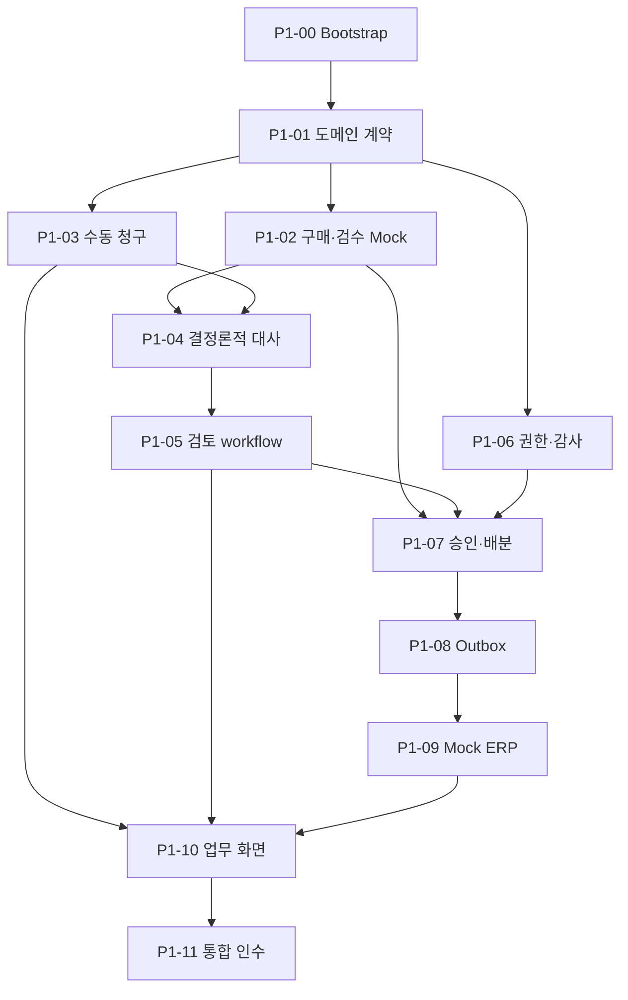

# Invoice Match 구현 계획

문서 상태: **Phase 2 완료 · Phase 3 착수 · 현재 Ticket P3-00**
작성일: **2026-09-25**
기준 문서: [`Spec.md` 1.1-confirmed](./Spec.md)  
실행 방법: [`Implement.md`](./Implement.md)

업무 범위, 용어, 상태, 불변식과 책임 경계는 `Spec.md`를 따른다. 이 문서는 Phase별 목표와 현재 Ticket의 구현·인수 계약을 정의한다. 완료 Ticket은 상태와 후속 진입점만 남기며 구현·검증 경과는 코드/Git/ignored output에서 확인한다.

## 1. Phase 1~5 로드맵

| Phase | 목표 | 핵심 산출물 | 완료 기준 |
|---|---|---|---|
| 1 — AI 없는 업무 코어 | 수동 입력으로 핵심 업무 불변식과 끝단 흐름 검증 | Spring core, PostgreSQL, 구매 Mock, 결정론적 대사, 검토/RBAC/감사, 동시 배분, 지급요청 Outbox, Mock ERP, 얇은 Next.js UI | 정상·5개 예외·보완·거절·승인·인계를 재현하고 동시 승인에서도 초과 배분 0건 |
| 2 — 문서와 비동기 처리 | 파일 접수와 느린 작업·외부 장애 격리 | MinIO, presigned upload, PDF/Excel parser, 원본 미리보기·다운로드, PDF 표준 인쇄, AnalysisRun, RabbitMQ, retry/DLQ, 운영 화면 | worker/broker 중단과 중복 메시지에도 사건 유실·업무 중복 없음 |
| 3 — AI 추출·매핑·근거 | 비정형 해석을 구조화하고 품질 측정 | Document/Item Mapping/Evidence/Resolution agent, 읽기 전용 도구, pgvector, schema validation, 평가셋 | 비-AI 기준선 대비 품질·비용·지연·실패 유형 제시 |
| 4 — Human-in-the-loop | 사람 대기와 재개를 안전하게 모델링 | LangGraph checkpoint, mapping interrupt, 새 증빙 재분석, resume 멱등성, stale 차단 | worker/message 점유 없이 정확한 version만 재개·반영 |
| 5 — 최적화·장애 시연·포트폴리오 | 측정 가능한 개선과 재현 가능한 설명 완성 | 조회·인덱스 실험, 부하·경합·장애 주입, ERP 대사, 관측성, README/ERD/보고서 | 5~7분 시연, Docker Compose 재현, 성능·AI 평가 결과와 trade-off 설명 |

Phase 2는 사용자 착수 지시(2026-10-02)에 따라 아래 Ticket 순서로 진행한다. Phase 1 자동 인수와 CI는 통과했으며, 사람의 5~7분 시연 미실측은 별도 확인 항목으로 유지한다. Phase 3의 Ticket은 아래 계약으로 구체화했다. Phase 4~5는 직전 Phase 완료 검토 후 상세화한다.

### 후속 설계 결정·보류 (2026-10-01)

- **문서 인식:** Azure Document Intelligence의 `prebuilt-invoice`, F0로 시작한다. 자체 OCR 서버의 자원·운영 부담과 초기 비용을 줄이는 선택이며, 한국어 청구서의 품목·수량·단가 정확도는 실제 샘플로 검증한다. 선택만 확정했으며 연동 구현은 시작하지 않았다. F0의 파일·페이지·호출 제한과 실제 문서의 외부 전송 조건은 착수 시 확인하고, 한도 초과 시 유료 전환을 자동으로 가정하지 않는다.
- **품목 확인의 한계:** 제출 성공은 품목명과 내부 품목의 의미가 일치한다는 보장이 아니다. A3 품목에 A4 품목 ID를 지정해도 수치 비교만으로 의미 오류를 검출할 수 없다. 향후 원문 품목명과 선택한 내부 품목을 함께 확인하게 하며, 이름의 단순 문자열 일치나 AI 추천만으로 매핑을 확정하지 않는다. 구체적인 선택·확인 UX와 검증 정책은 미확정이다.
- **식별자 입력:** 공급사·발주 검색/선택은 OCR과 별개의 개선이다. 공급사마다 양식이 달라도 문서에서 읽은 명칭·번호를 내부 공급사·발주 식별자로 그대로 간주하지 않는다. 검색 API와 선택 UX는 아직 착수하지 않는다.
- **인증:** 현재 시연용 인증을 실사용 인증으로 확정하지 않는다. 서버 세션과 JWT Access/Refresh Token 회전 방식을 비교했으나 채택은 보류한다. 단일 기업용 서비스의 전용 계정 로그인을 기준으로 검토하며 SSO·Redis 도입을 필수 전제로 두지 않는다.

### Phase 2+ 인계 계약 (Phase 1 동결 인터페이스)

Phase 2는 문서·비동기 처리(오브젝트 스토리지, presigned 업로드, PDF/Excel 파서, 원본 미리보기/다운로드/인쇄, `AnalysisRun`, RabbitMQ, 제한 재시도/DLQ, 운영 재처리)만 담당한다. AI 추출·매핑·근거(pgvector·평가셋)는 Phase 3, LangGraph checkpoint·human-in-the-loop 재개는 Phase 4, 최적화·관측성은 Phase 5다.

Phase 1이 동결한 인터페이스는 다음이며 Phase 2+가 조용히 바꾸지 않는다.

- 승인 대상은 `ReviewSnapshot`이다. 새 스냅샷은 canonical `review-snapshot-v2`(객체 key 재귀 정렬, 배열 순서 보존)이고, 이미 발급된 `review-snapshot-v1`은 재작성하지 않는다. 검증은 저장된 `schemaVersion`이 지정한 **단일** 알고리즘으로만 수행하며 v1↔v2 fallback은 없다(missing/unknown은 fail-closed, v1로 재구성 불가능한 스냅샷은 `409 REVIEW_STATE_CONFLICT` 후 v2로 재-freeze).
- `EvidenceBundle`(id/version/hash)과 canonical `match-result-v3` payload가 대사 기준선이다. AI 결과는 검토 자료로만 붙고 승인 효력을 갖지 않는다.
- 승인은 `ReviewSnapshot` + `ReceiptAllocation` + APPROVED `ReviewDecision` + `PaymentRequest` + Outbox + audit을 한 트랜잭션으로 처리하며, 검수 잔량을 초과 배분하지 않는다.
- Outbox 이벤트 계약(`PaymentRequestExportRequested`)과 외부 키(export idempotency key = `paymentRequestId:exportVersion`, webhook dedup = `provider + externalEventId`)를 유지한다. `RESULT_UNKNOWN`은 blind 재전송하지 않고 서명 결과가 같은 키로 한 번 수렴시킨다. `ACKNOWLEDGED`는 ERP 인계 접수이며 실제 송금이 아니다.
- actor-scoped idempotency `(scope, resource_key, actor, requestId)`와 서버 파생 actor/audit을 유지한다.
- `POST /api/invoice-cases/{id}/revisions`는 `SUPPLEMENT_REQUIRED`에서만 허용한다. `REJECTED`는 terminal이며 재개할 수 없다.
- `Document`/`AnalysisRun`/`Proposal`과 분석 실행 상태(`QUEUED→RUNNING→…`)는 Phase 1에 없다.

## 2. Phase 1 Backlog

### P1-00 — 저장소와 실행 기준선

**상태: 완료.** 업무 범위·불변식은 Spec과 Phase 2+ 동결 인터페이스를 따른다.

### P1-01 — 도메인 계약과 DB 기준선

**상태: 완료.** 업무 범위·불변식은 Spec과 Phase 2+ 동결 인터페이스를 따른다.

### P1-02 — 구매·검수 Mock과 로컬 Snapshot

**상태: 완료.** 업무 범위·불변식은 Spec과 Phase 2+ 동결 인터페이스를 따른다.

### P1-03 — 수동 청구와 증빙 묶음 Versioning

**상태: 완료.** 업무 범위·불변식은 Spec과 Phase 2+ 동결 인터페이스를 따른다.

### P1-04 — 결정론적 3-way 대사

**상태: 완료.** 업무 범위·불변식은 Spec과 Phase 2+ 동결 인터페이스를 따른다.

### P1-05 — 검토·매핑·보완·거절

**상태: 완료.** 업무 범위·불변식은 Spec과 Phase 2+ 동결 인터페이스를 따른다.

### P1-06 — 역할 권한과 감사이력

**상태: 완료.** 업무 범위·불변식은 Spec과 Phase 2+ 동결 인터페이스를 따른다.

### P1-07 — 원자적 승인과 동시 배분

**상태: 완료.** 업무 범위·불변식은 Spec과 Phase 2+ 동결 인터페이스를 따른다.

### P1-08 — 지급요청과 최소 Transactional Outbox

**상태: 완료.** 업무 범위·불변식은 Spec과 Phase 2+ 동결 인터페이스를 따른다.

### P1-09 — Mock ERP와 Webhook 멱등성

**상태: 완료.** 업무 범위·불변식은 Spec과 Phase 2+ 동결 인터페이스를 따른다.

### P1-10 — 조회 API와 최소 업무 화면

**상태: 완료.** 업무 범위·불변식은 Spec과 Phase 2+ 동결 인터페이스를 따른다.

### P1-11 — Phase 1 통합 인수

**상태: 완료.** 업무 범위·불변식은 Spec과 Phase 2+ 동결 인터페이스를 따른다.

## 3. Phase 2 Backlog

### P2-00 — 비공개 문서 저장소 실행 기준선

**상태: 완료.** 비공개 MinIO 실행 기준선. 이미지·설정은 `infra/minio/`와 `compose.storage.yaml`이 기준이다.

### P2-01 — Document 접수와 presigned 업로드

**상태: 완료.** 문서 접수·presigned 업로드·원본 등록. 후속 진입점은 `core-api/document/application/DocumentService`다.

### P2-02 — 제출 문서 증빙 동결과 보완 참조 보존

**상태: 완료.** 문서 증빙 동결·보완 참조 보존. 후속 진입점은 `InvoiceCaseWriteService`와 `EvidenceBundleHasher`다.

### P2-03 — 권한 있는 원본 조회와 PDF 미리보기·다운로드

**상태: 완료.** 권한 있는 다운로드와 PDF 미리보기. PC 인쇄 미리보기의 사람 확인은 별도 대기다.

### P2-04 — 제한된 자원의 PDF text layer·XLSX 구조 파서

**상태: 완료.** Linux process 격리 PDF/XLSX parser. 한도·wire·설치 실행은 `ai-worker/`와 Spec 15절을 따른다.

### P2-05 — AnalysisRun과 분석 요청 transactional Outbox

**상태: 완료.** 제출 transaction의 AnalysisRun·분석 Outbox 예약. 후속 진입점은 `AnalysisRequestService`다.

### P2-06 — 분석 요청 RabbitMQ publisher relay

**상태: 완료.** RabbitMQ confirm·lease relay. `RabbitAnalysisRequestPublisher`는 plain TCP 전용이며 TLS 도입 시 socket 소유 경계를 재검토한다.

### P2-07 — 분석 실행 claim과 문서별 결과 멱등 반영

**상태: 완료.** core-api 실행 lease·기계 인증·문서별 멱등 결과 반영을 인수했다. Python consumer와 원본 접근 연결은 P2-08에서 이어간다.

후속 Ticket은 현재 [기계 API](../core-api/src/main/java/com/invoicematch/core/analysis/api/AnalysisRunController.java), [실행 서비스](../core-api/src/main/java/com/invoicematch/core/analysis/application/AnalysisExecutionService.java), [결과 validator](../core-api/src/main/java/com/invoicematch/core/analysis/application/AnalysisResultValidator.java)를 계약 진입점으로 사용한다. API/schema·검증 수치는 여기 복제하지 않는다.

### P2-08 — Python consumer와 실행 권한 기반 원본 접근

**상태: 완료.** Python consumer·실행 권한 기반 원본 접근·설치 이미지·실제 서비스 통합 인수를 완료했다. 후속 진입점은 `ai-worker/application/execution.py`, `RabbitConsumer`, `AnalysisSourceService`와 `scripts/verify-p2-08.mjs`다. 재시도 예약 전 장애는 ACK 없이 fail-stop하며, 이 한계는 P2-09에서 해소한다.

### P2-09 — 제한 재시도와 영속 실패 이력·DLQ

**상태: 완료.** DB 실패 checkpoint·제한 실행 재시도·recovery relay·confirm DLQ를 인수했다. `AnalysisRecoveryService`와 `AnalysisRecoveryStore`가 후속 진입점이다. 동일 eventId와 immutable 부분 결과를 유지하며 core/auth 장애로 checkpoint를 저장하지 못하면 ACK 없이 중단한다. broker 발행 예약은 연결 복구까지 보존한다.

### P2-10 — 운영자 분석 조회·재처리

**상태: 완료.** 운영자 페이지 목록·실패 이력·수동 재처리와 감사/멱등 계약을 인수했다. `AnalysisOperationsService`가 후속 진입점이다. 재처리는 현재 DEAD_LETTERED에만 추가 3회 예산을 주며 기존 결과·실패 이력·eventId를 보존한다. `/operations/analysis`는 서버 자료를 조회하고 결과 불명 시 동일 요청을 재확인한다.

### P2-11 — 만료 임시 업로드 정리

**상태: 완료.** opt-in 정리와 lease ledger를 인수했다. `DocumentCleanupService`가 후속 진입점이다. 예약 만료 후 기본 24시간(최소 1시간)을 지난 정확한 임시 경로만 삭제하며 원본·등록 metadata·동결 참조를 보존한다. 실패 backoff와 옛 token fencing을 유지하고 S3/원본 orphan 탐색은 하지 않는다.

### P2-12 — 페이즈2 통합 인수

**상태: 완료.** 전체 회귀와 실제 broker 중단·worker 강제 종료·lease 복구·중복·부분 결과·DLQ·운영 재처리를 인수했다. 후속 진입점은 `scripts/verify-p2-08.mjs`다. 임시 검증 자원은 회수했다.

원격 CI 결과와 PDF 인쇄 버튼→PC 인쇄 미리보기는 사용자 요청에 따라 별도 일괄 확인한다. 프린터 출력은 인수 조건이 아니다. Azure 스캔 OCR·AI 추출/매핑·근거는 Phase 3에서 다룬다.

## 4. Phase 3 Backlog

Phase 3는 **P3-00~P3-09**를 Head가 순차 구현한다. Spec 8·9·18·24.3절과 아래 계약을 따른다. 구현 세부 목록·실행 로그는 복제하지 않는다.

### 공통 계약

- AI는 처리 제안이다. 원본·수동 입력·P2 파서 결과·대사 결과를 변경하지 않으며 매핑 확정·승인·배분·지급 Tool을 제공하지 않는다. 사람의 기존 업무 action만 업무 효력을 갖는다.
- 현재 증빙의 파서 성공과 사람이 실행한 최신 대사 결과가 준비된 뒤 OPERATOR가 분석을 예약한다. 같은 증빙이라도 새 대사·매핑·구매 snapshot은 새 입력이다. 제안은 증빙/대사/구매 hash와 매핑 watermark에 묶고, 현재성과 저장된 출처를 서버가 검증한다.
- P2의 `document-parser-v1` wire/결과와 승인 API는 보존한다. AI 실행은 별도 `ai-review-v1` 작업과 RabbitMQ routing으로 격리한다. DB 예약·실행 lease·단계 결과·호출 예산을 보존하고 중복 전달에는 동일 결과를 재생한다. 외부 모델 호출 exactly-once는 주장하지 않는다.
- application은 권한·검증·예산·transaction orchestration, persistence는 SQL·잠금·조건부 저장, infrastructure는 SDK/HTTP/broker/process를 맡는다. domain은 바깥 계층에 의존하지 않는다. Head가 실제 diff를 검수하고 새 architecture scanner는 만들지 않는다.
- AI는 기본 비활성화다. 모델/provider/인증/요금 단가는 환경 설정이며 특정 모델이나 유료 전환을 가정하지 않는다. live OCR/LLM 평가는 사용자가 준비한 설정과 비용 한도에서만 실행한다. mock/offline 통과를 실제 AI 정확도로 보고하지 않는다.
- 단일 시연 회사의 정책 scope를 서버에서 고정한다. 계약과 발주 연결, 공급사, 문서 version, 유효 기간, 읽기 권한을 검색 전에 적용한다. 청구서에서 추출한 계약번호·날짜만으로 scope를 넓히지 않는다. 적용일은 동결 제출일이며 실제 계약 적용 기준이 다른 경우 확정된 계약 metadata로 바꾼다.
- 반복·도구·입출력 토큰·응답 크기·전체 wall time은 유한하다. 성공한 단계는 immutable checkpoint로 재사용하고, 불확실한 외부 호출도 예약 예산을 소비한다. 초과/근거 부족/충돌은 검토 필요 상태로 끝낸다.

### P3-00 — AI 실행과 immutable 처리 제안 계약

**상태: 진행 중.** 현재 parser run + 특정 최신 MatchResult를 입력으로 하는 AI 예약·context hash·lease·실행 예산·단계 checkpoint·최종 Proposal 저장을 추가한다. OPERATOR 예약은 actor-scoped idempotency/audit와 같은 transaction이다. parser 실패·구버전·다른 사건·변경된 context는 거부한다. 새 대사/보완은 옛 제안을 조회 이력으로만 보존한다.

인수: 실제 PostgreSQL에서 예약 replay/동시성/audit rollback, 입력 composite FK/identity·결과 immutable, 만료 token fencing, 예산 소진과 stale 결과 무효를 검증한다. 업무 case version/배분/지급 효과는 0이다.

### P3-01 — Azure 스캔 OCR adapter

**상태: 예정.** `prebuilt-invoice`의 고정 REST version으로 빈 text layer PDF를 처리한다. Core가 실행 권한과 frozen metadata를 검사하여 제공한 원본만 전송한다. F0의 4 MB·2페이지를 넘으면 유료 전환이나 조용한 잘림 없이 검토 필요로 처리한다. operation URL은 설정한 HTTPS origin/경로만 허용하고 polling·429/5xx·timeout·응답 크기를 제한한다. OCR text/field/page/span/좌표와 provider version은 별도 checkpoint이며 기존 parser 결과를 덮어쓰지 않는다.

인수: 실제 local HTTP fixture로 submit/poll/정상·제한·실패·다른 origin·redirect·과대 응답과 위치 검증. 실제 Azure 품질은 설정 제공 후 평가셋에서 별도로 측정한다.

### P3-02 — Document Agent와 구조·숫자·출처 검증

**상태: 예정.** PDF text layer/XLSX cell/OCR의 출처를 유지한 header·line 후보를 구조화한다. 모델 출력은 strict schema로 받고 원문에서 찾을 수 있는 page/span 또는 sheet/cell을 요구한다. 날짜·통화·수량·단가 normalization과 산술 검사는 일반 코드다. 잘못된 출력 repair는 전체 예산 안에서 최대 한 번이며, 후보를 수동 청구 입력에 자동 반영하지 않는다.

인수: 한국어, 숫자 구분자·통화·날짜, 잘못된 page/cell/quote, 중복/unknown field, injection·과대 출력·timeout·repair 소진 회귀. 원문 부재는 추측으로 채우지 않는다.

### P3-03 — 사건 범위 읽기 전용 Tool

**상태: 예정.** 사건에 연결된 발주·확정 검수·품목 후보·동일 공급사의 확정 매핑·계약 metadata를 제공한다. scope는 서버 context에서 파생하고 모델이 전달한 임의 사건/발주/공급사로 바꾸지 않는다. 결과 개수·문자 수·호출 수를 제한하고 사용자·비밀·저장소 key를 제외한다. deterministic matching 실행·승인·지급 쓰기는 노출하지 않는다.

인수: 기계 인증/사람 권한 분리, 다른 사건/공급사 차단, stale context 차단, bounded 결과와 쓰기 Tool 부재.

### P3-04 — 정책 catalog와 exact pgvector hybrid 검색

**상태: 예정.** 가상 계약/지침의 immutable 문서 version·유효 기간·페이지/문단과 계약 연결을 저장한다. 권한 있는 ingestion에서 chunk와 embedding model/version/dimension을 기록하고 검색 model과 일치시킨다. scope 필터 후 lexical + exact vector를 결합한다. 기존 일반 PostgreSQL/P2 실행은 AI 비활성 상태로 계속 동작하며 pgvector는 opt-in 구성과 실제 vector DB 검증을 둔다. HNSW/reranker/Redis는 측정 근거 없이 추가하지 않는다.

인수: 실제 pgvector에서 회사·공급사·계약·유효일·version 필터, model/dimension 불일치, 동률 순서, top-k 제한, lexical/vector/hybrid 기준선. 근거 없음과 충돌을 별도로 반환한다.

### P3-05 — Item Mapping Agent

**상태: 예정.** 원문 품목과 읽기 전용 품목/과거 확정 매핑을 사용해 최대 3개 후보·이유·출처를 제시한다. 반환 ID는 서버가 제공한 후보에 속해야 하며 A3/A4·규격 차이와 복수 후보는 검토를 요구한다. confidence를 확정 권한으로 사용하지 않는다.

인수: 별칭·한국어·규격 혼동·없는 품목·과거 공급사 범위·모호함·후보 없음과 Recall@1/3 evaluator.

### P3-06 — Evidence/Resolution Agent

**상태: 예정.** 검증된 대사 예외와 검색 근거로 보완요청·승인검토·거절검토 초안을 만든다. 근거 ID/version/page/paragraph/quote를 저장된 적용 문단과 대조한다. 무근거·충돌에는 `INSUFFICIENT_EVIDENCE`/`REVIEW_REQUIRED`를 요구하고 금액·잔량은 코어 사실을 인용한다. 결론을 업무 상태로 반영하지 않는다.

인수: 가짜 citation, 구버전 정책, 잘못된 수치, 근거 없음/충돌, prompt injection과 무단 Tool 거부. 동일 입력의 canonical hash/replay 보존.

### P3-07 — AI consumer와 복구·예산 연결

**상태: 예정.** 위 단계들을 제한된 실행 순서로 연결하고 별도 RabbitMQ queue의 prefetch=1/manual ACK를 사용한다. 단계마다 lease/currentness를 재확인하고 성공 checkpoint는 재사용한다. 요청 예약이 전달 전 장애에도 보존되고, 중단·응답 유실·중복·외부 실패는 제한 실행 예산과 durable checkpoint로 수렴한다. 장시간 사람 대기/graph resume는 P4다.

인수: 실제 broker/Core/설치 worker에서 checkpoint 후 종료, 모델 응답/최종 저장 응답 유실, lease reclaim, 429/timeout/소진, 중복 완료와 stale 차단. 외부 호출·tool/token budget은 재claim에도 초기화하지 않는다.

### P3-08 — AI 검토 화면과 선택적 freeze

**상태: 예정.** 기존 사건 상세에 추출 후보·품목 후보·근거·초안·분석 상태/실행 출처를 보여준다. 예약은 OPERATOR만 가능하고 기존 사람 action을 사용한다. 현재 제안만 새 ReviewSnapshot의 선택적 근거로 동결하며 승인 검증은 snapshot에 들어간 정확한 Proposal/hash를 재구성한다. 제안이 없는 기존 v1/v2 snapshot과 승인 API의 동작/hash를 보존한다.

인수: 실제 서비스/브라우저에서 정상·없는 제안·실패·stale·보완/새 매핑, 늦은 응답/세션 교체. 실제 PostgreSQL 승인 forged proposal/다른 사건/hash 변조 거부와 legacy 승인 회귀. 인쇄/remote CI는 기존 사용자 확인 항목이다.

### P3-09 — 평가와 Phase 3 통합 인수

**상태: 예정.** 사람이 작성·수정한 표현과 프로그램으로 만든 layout/noise/구버전/무근거 사례를 포함한 고정 60~100건 평가셋을 유지한다. text/cell/OCR·품목·검색·처리 제안의 gold를 분리하고 동일 사례에 비-AI 기준선과 configured AI를 비교한다. field/numeric/location 정확도, Recall@1/3/k·version, 기대 분기·무근거 주장, 호출/토큰/재시도·latency/요금 단가 기반 비용을 측정한다. 설정 미제공이면 live 미측정을 명시하고 offline contract/기준선만 공개한다. 사람 검토시간은 실제 측정 전 작성하지 않는다.

인수: backend 전체 test/bootJar, Web lint/test/build, 실제 Linux worker/wheel/CLI, 실제 pgvector/broker 연결 및 AI 오류 회귀. code-verifiable 설명을 늘리지 않고 기존 Spec/Plan/README와 의미 있는 EngineeringNotes만 갱신한다. 실제 AI 품질이 채택 기준을 충족하기 전 기본 활성화하지 않는다.

## 5. Ticket 의존성

## 6. 유지보수 Ticket

### R1-01 — 백엔드 3계층/클린코드 정리

**상태: 완료.** 책임 분리의 이유는 기존 EngineeringNotes에 남기고 구현·검증 목록은 코드와 Git에서 확인한다.

### R1-02 — main CI IntegrationTest 실패 조사·복구

**상태: 완료.** 테스트와 애플리케이션의 webhook secret 설정 우선순위를 바로잡았다. 사용자가 해당 CI 통과를 확인했다. 이후 변경의 원격 CI 결과는 사용자 요청에 따라 일괄 확인한다.
