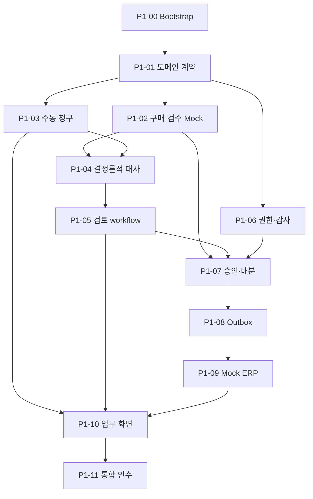

# Invoice Match 구현 계획

문서 상태: **Phase 1 착수 기준선**  
작성일: **2026-09-25**  
기준 문서: [`Spec.md` 1.1-confirmed](./Spec.md)  
실행 방법: [`Implement.md`](./Implement.md)

업무 범위, 용어, 상태, 불변식과 책임 경계는 `Spec.md`를 따른다. 이 문서는 Phase별 목표, Phase 1 Ticket, 의존성과 검증 기준만 정의한다. 각 Ticket에 반복한 규칙은 작업자가 그 Ticket만 읽고 안전하게 실행하도록 발췌한 계약이며, 별도의 원본 정의가 아니다.

## 1. Phase 1~5 로드맵

| Phase | 목표 | 핵심 산출물 | 완료 기준 |
|---|---|---|---|
| 1 — AI 없는 업무 코어 | 수동 입력으로 핵심 업무 불변식과 끝단 흐름 검증 | Spring core, PostgreSQL, 구매 Mock, 결정론적 대사, 검토/RBAC/감사, 동시 배분, 지급요청 Outbox, Mock ERP, 얇은 Next.js UI | 정상·5개 예외·보완·거절·승인·인계를 재현하고 동시 승인에서도 초과 배분 0건 |
| 2 — 문서와 비동기 처리 | 파일 접수와 느린 작업·외부 장애 격리 | MinIO, presigned upload, PDF/Excel parser, 원본 미리보기·다운로드, PDF 표준 인쇄, AnalysisRun, RabbitMQ, retry/DLQ, 운영 화면 | worker/broker 중단과 중복 메시지에도 사건 유실·업무 중복 없음 |
| 3 — AI 추출·매핑·근거 | 비정형 해석을 구조화하고 품질 측정 | Document/Item Mapping/Evidence/Resolution agent, 읽기 전용 도구, pgvector, schema validation, 평가셋 | 비-AI 기준선 대비 품질·비용·지연·실패 유형 제시 |
| 4 — Human-in-the-loop | 사람 대기와 재개를 안전하게 모델링 | LangGraph checkpoint, mapping interrupt, 새 증빙 재분석, resume 멱등성, stale 차단 | worker/message 점유 없이 정확한 version만 재개·반영 |
| 5 — 최적화·장애 시연·포트폴리오 | 측정 가능한 개선과 재현 가능한 설명 완성 | 조회·인덱스 실험, 부하·경합·장애 주입, ERP 대사, 관측성, README/ERD/보고서 | 5~7분 시연, Docker Compose 재현, 성능·AI 평가 결과와 trade-off 설명 |

Phase 2~5의 Ticket은 직전 Phase 완료 검토 후 상세화한다.

### 후속 설계 결정·보류 (2026-10-01)

- **문서 인식:** Azure Document Intelligence의 `prebuilt-invoice`, F0로 시작한다. 자체 OCR 서버의 자원·운영 부담과 초기 비용을 줄이는 선택이며, 한국어 청구서의 품목·수량·단가 정확도는 실제 샘플로 검증한다. 선택만 확정했으며 연동 구현은 시작하지 않았다. F0의 파일·페이지·호출 제한과 실제 문서의 외부 전송 조건은 착수 시 확인하고, 한도 초과 시 유료 전환을 자동으로 가정하지 않는다.
- **품목 확인의 한계:** 제출 성공은 품목명과 내부 품목의 의미가 일치한다는 보장이 아니다. A3 품목에 A4 품목 ID를 지정해도 수치 비교만으로 의미 오류를 검출할 수 없다. 향후 원문 품목명과 선택한 내부 품목을 함께 확인하게 하며, 이름의 단순 문자열 일치나 AI 추천만으로 매핑을 확정하지 않는다. 구체적인 선택·확인 UX와 검증 정책은 미확정이다.
- **식별자 입력:** 공급사·발주 검색/선택은 OCR과 별개의 개선이다. 공급사마다 양식이 달라도 문서에서 읽은 명칭·번호를 내부 공급사·발주 식별자로 그대로 간주하지 않는다. 검색 API와 선택 UX는 아직 착수하지 않는다.
- **인증:** 현재 시연용 인증을 실사용 인증으로 확정하지 않는다. 서버 세션과 JWT Access/Refresh Token 회전 방식을 비교했으나 채택은 보류한다. 단일 기업용 서비스의 전용 계정 로그인을 기준으로 검토하며 SSO·Redis 도입을 필수 전제로 두지 않는다.

### Phase 2+ 인계 계약 (Phase 1 동결 인터페이스)

Phase 2는 문서·비동기 처리(오브젝트 스토리지, presigned 업로드, PDF/Excel 파서, 원본 미리보기/다운로드/인쇄, `AnalysisRun`, RabbitMQ, 제한 재시도/DLQ, 운영 재처리)만 담당한다. AI 추출·매핑·근거(pgvector·평가셋)는 Phase 3, LangGraph checkpoint·human-in-the-loop 재개는 Phase 4, 최적화·관측성은 Phase 5다.

Phase 1이 동결한 인터페이스는 다음이며 Phase 2+가 조용히 바꾸지 않는다.

- 승인 대상은 `ReviewSnapshot`이다. 새 스냅샷은 canonical `review-snapshot-v2`(객체 key 재귀 정렬, 배열 순서 보존)이고, 이미 발급된 `review-snapshot-v1`은 재작성하지 않는다. 검증은 저장된 `schemaVersion`이 지정한 **단일** 알고리즘으로만 수행하며 v1↔v2 fallback은 없다(missing/unknown은 fail-closed, v1로 재구성 불가능한 스냅샷은 `409 REVIEW_STATE_CONFLICT` 후 v2로 재-freeze).
- `EvidenceBundle`(id/version/hash)과 canonical `match-result-v3` payload가 대사 기준선이다. AI 결과는 검토 자료로만 붙고 승인 효력을 갖지 않는다.
- 승인은 `ReviewSnapshot` + `ReceiptAllocation` + APPROVED `ReviewDecision` + `PaymentRequest` + Outbox + audit을 한 트랜잭션으로 처리하며, 검수 잔량을 초과 배분하지 않는다.
- Outbox 이벤트 계약(`PaymentRequestExportRequested`)과 외부 키(export idempotency key = `paymentRequestId:exportVersion`, webhook dedup = `provider + externalEventId`)를 유지한다. `RESULT_UNKNOWN`은 blind 재전송하지 않고 서명 결과가 같은 키로 한 번 수렴시킨다. `ACKNOWLEDGED`는 ERP 인계 접수이며 실제 송금이 아니다.
- actor-scoped idempotency `(scope, resource_key, actor, requestId)`와 서버 파생 actor/audit을 유지한다.
- `POST /api/invoice-cases/{id}/revisions`는 `SUPPLEMENT_REQUIRED`에서만 허용한다. `REJECTED`는 terminal이며 재개할 수 없다.
- `Document`/`AnalysisRun`/`Proposal`과 분석 실행 상태(`QUEUED→RUNNING→…`)는 Phase 1에 없다.

## 2. Phase 1 Backlog

### P1-00 — 저장소와 실행 기준선

**목적과 범위:** Git 저장소, Java 21 Spring Boot 3 `core-api`, Next.js TypeScript `web`, PostgreSQL, Mock ERP의 실행 골격과 Docker Compose/CI를 만든다. AI worker, MinIO, RabbitMQ는 제외한다.

**관련 규칙/불변식:** Spring은 단일 애플리케이션의 package-by-feature 구조로 시작한다. secret을 커밋하지 않으며 시각은 UTC로 저장한다.

**Acceptance Criteria:** 문서화된 명령으로 core, web, postgres, mock-erp가 기동되고 health check, lint, test, build가 통과한다.

**테스트/검증:** clean build, Compose smoke, DB 연결, CI 최소 pipeline.

**의존성:** 없음.

**사람 확인:** README만 보고 새 터미널에서 실행 가능한지, 구조를 2분 안에 설명할 수 있는지 확인한다.

### P1-01 — 도메인 계약과 DB 기준선

**목적과 범위:** 상태 전이, 식별자, 금액/수량 type과 `InvoiceCase`, draft revision, `EvidenceBundle`, `InvoiceLine`, `MatchResult`, `ReviewSnapshot`, `ReviewDecision`의 최소 schema를 구현한다.

**관련 규칙/불변식:** 원 단위 KRW와 정수 수량을 사용한다. 한 사건은 한 공급사·한 발주만 참조한다. 제출된 증빙 묶음과 검토 결정은 수정하지 않는다.

**Acceptance Criteria:** 잘못된 상태 전이와 값이 거부되고, 사건 optimistic version과 migration이 존재하며 entity를 API로 직접 직렬화하지 않는다.

**테스트/검증:** 상태 전이 parameterized test, PostgreSQL migration test, 금액 경계값 test.

**의존성:** P1-00.

**사람 확인:** `Spec.md`의 용어·상태·불변식과 schema가 일치하는지 확인한다.

### P1-02 — 구매·검수 Mock과 로컬 Snapshot

**목적과 범위:** 외부 구매시스템 Mock API, read-only adapter, PO/검수 snapshot과 external version 동기화를 구현한다.

**관련 규칙/불변식:** 외부 Mock은 발주·검수 사실의 정본이고 `ReceiptAllocation`은 이 시스템에서 소비한 수량의 정본이다. 오래된 외부 version이 최신 snapshot을 덮어쓰지 않는다.

**Acceptance Criteria:** PO, 공급사, 품목, 검수와 version을 조회·동기화하고 부재·불일치·미확정을 구분한다. 같은 version refresh는 멱등하다.

**테스트/검증:** API 계약, version 역행, timeout, 잘못된 payload, 반복 refresh 통합 test.

**의존성:** P1-01.

**사람 확인:** 외부 검수량과 로컬 사용량이 화면·로그·문서에서 명확히 구분되는지 확인한다.

### P1-03 — 수동 청구와 증빙 묶음 Versioning

**목적과 범위:** 사건 생성, draft 편집, 제출, 보완 후 다음 revision 작성/제출 API와 request-id 멱등 처리를 구현한다.

**관련 규칙/불변식:** draft만 수정할 수 있다. 제출 시 수동 입력을 수정 불가능한 `EvidenceBundle vN`으로 동결하며 보완은 vNext로 만든다.

**Acceptance Criteria:** header/line 작성과 제출, bundle version/hash 생성, 제출 후 수정 차단, 보완 재제출, 과거 version 조회가 가능하다. 같은 requestId의 다른 payload는 conflict다.

**테스트/검증:** validation/idempotency, v1→보완→v2 보존, 동시 draft 수정 test.

**의존성:** P1-01, P1-02의 PO 조회 계약.

**사람 확인:** 제출 값을 조용히 덮어쓰는 경로가 없는지, 보완 전후 차이를 읽을 수 있는지 확인한다.

### P1-04 — 결정론적 3-way 대사

**목적과 범위:** 품목/PO line, 단가, 청구수량, 검수 잔량을 비교해 결과와 계산 근거, 예상 배분계획을 만든다.

**관련 규칙/불변식:** 허용오차 0, 잔량 이하 부분 청구 허용, 복수 검수 FIFO 배분, AI 미사용, 업무상 중복과 기술적 멱등성 분리를 지킨다.

**Acceptance Criteria:** 정상, 수량 초과, 단가 차이, 품목 미확정, 번호 중복, 근거 부족과 복수 예외를 재현하며 같은 입력은 같은 결과/hash를 만든다.

**테스트/검증:** table-driven test, 배분 합계·잔량 비초과 property test, 잔량 경계와 단가 1원 차이 test.

**의존성:** P1-02, P1-03.

**사람 확인:** 예외 설명을 입력값으로 재계산할 수 있고 FIFO가 V1 정책으로 표시되는지 확인한다.

### P1-05 — 검토·매핑·보완·거절

**목적과 범위:** 품목 매핑 확정, 재대사, 보완요청, 거절, 승인용 `ReviewSnapshot`과 canonical hash를 구현한다.

**관련 규칙/불변식:** 매핑은 현재 사건에만 적용한다. source bundle, 대사 결과, 매핑, 예상 배분, 금액을 snapshot에 포함하며 source 변경 시 stale 처리한다.

**Acceptance Criteria:** 미확정 품목을 사람이 확정해 재대사하고, 보완/거절 사유를 기록하며, stale snapshot으로 승인할 수 없다.

**테스트/검증:** 매핑 전후 결과, bundle/mapping 변경 후 stale, 잘못된 상태 action test.

**의존성:** P1-04.

**사람 확인:** 승인 화면의 사실과 hash 대상 payload가 동일하며 AI 없이도 판단 근거를 이해할 수 있는지 확인한다.

### P1-06 — 역할 권한과 감사이력

**목적과 범위:** `SUBMITTER`, `APPROVER`, `OPERATOR` 역할, 로컬 시연 사용자, action 권한과 append-only 감사이력을 구현한다.

**관련 규칙/불변식:** 제출자의 자기 승인을 금지한다. 감사이력은 actor, action, 대상 version, 의미 있는 변경, request/trace ID를 포함하며 비밀정보를 남기지 않는다.

**Acceptance Criteria:** 역할별 허용/거부가 적용되고 자기 승인은 차단된다. 제출·매핑·보완·거절·승인·revision·재처리 이력이 남는다.

**테스트/검증:** 권한 matrix, 자기 승인, 비인증 접근, 감사 이벤트 누락/민감정보 test.

**의존성:** P1-01. P1-03~05와 계약 고정 후 병렬 통합 가능.

**사람 확인:** 정산 담당자와 승인자의 action이 실제로 구분되고 감사 diff가 업무적으로 읽히는지 확인한다.

### P1-07 — 원자적 승인과 동시 배분

**목적과 범위:** 최신 ReviewSnapshot 승인과 `ReceiptAllocation`, `ReviewDecision`, `PaymentRequest` 생성을 한 트랜잭션으로 구현한다.

**관련 규칙/불변식:** 사건/bundle/snapshot/external receipt version과 권한을 재검증한다. 검수 행을 고정 순서로 잠그고 전체 라인 성공 시에만 배분한다. 외부 호출 중 잠금을 유지하지 않는다.

**Acceptance Criteria:** 정상 승인은 정확한 배분과 지급요청 하나를 만든다. 잔량 60에 40+40 동시 승인 시 한 건만 성공하며 stale/중복 요청은 side effect 없이 실패한다.

**테스트/검증:** 실제 PostgreSQL 동시성 반복 test, rollback 주입, 같은 requestId 병렬 승인 test.

**의존성:** P1-02, P1-05, P1-06.

**사람 확인:** 두 번째 승인 실패 이유가 최신 잔량과 함께 표시되고 HTTP 호출이 잠금 범위 밖인지 확인한다.

### P1-08 — 지급요청과 최소 Transactional Outbox

**목적과 범위:** 승인 트랜잭션의 PaymentRequest/Outbox 저장과 pending event를 Mock ERP HTTP adapter로 전달하는 인프로세스 relay를 구현한다.

**관련 규칙/불변식:** 외부 지급요청 key는 유일하며 전달은 at-least-once일 수 있다. timeout은 실패 확정이 아니며 `RESULT_UNKNOWN`은 자동 blind resend하지 않는다.

**Acceptance Criteria:** relay 중단에도 event가 남고 중복 실행에도 지급요청이 늘지 않는다. 4xx와 timeout을 구분하고 relay 선점을 조건부 update/lease로 보호한다.

**테스트/검증:** commit 직후 중단, HTTP 성공 후 상태 변경 전 중단, 중복 relay, 선점 경합 test.

**의존성:** P1-07.

**사람 확인:** Outbox가 범용 프레임워크로 팽창하지 않고 exactly-once를 과장하지 않는지 확인한다.

### P1-09 — Mock ERP와 Webhook 멱등성

**목적과 범위:** idempotency key 기반 지급요청 수신, ACK/후속 webhook, signature/event/payment key 검증을 구현한다.

**관련 규칙/불변식:** 같은 key+같은 payload는 기존 결과, 다른 payload는 conflict다. webhook event는 한 번만 반영하며 unknown 결과에서 새 지급요청을 만들지 않는다.

**Acceptance Criteria:** 정상 인계 후 `EXPORTED/ACKNOWLEDGED`가 되고, 중복 요청·webhook에도 논리 지급요청은 하나다. 응답 유실과 위조/역순 event를 재현한다.

**테스트/검증:** 소비자 주도 계약, 중복/conflict/위조/역순/unknown key, 응답 유실 test.

**의존성:** P1-08, P1-06.

**사람 확인:** Mock ERP의 실제 레코드 수가 하나이며 `FAILED`와 `RESULT_UNKNOWN`이 구분되는지 확인한다.

### P1-10 — 조회 API와 최소 업무 화면

**진행 상태:** 완료(2026-10-01). 로그인·목록(`034fff4`), 상세·비교 조회(`57e7516`), 작성·검토·승인·인계·운영 연결(`003ff43`)까지 독립 리뷰 PASS로 인수했다. 실제 생성→저장→제출, 보완 작성/재제출, 운영자 비교 실행, 검토 대상 동결·매핑·보완요청·거절·승인, 지급요청/Outbox 조회와 역할별 내비게이션을 제공한다. 서버 계산값을 사용하고 표시 근거와 동결 대상이 다르면 결정을 차단하며, 미확정 쓰기는 동일 payload/requestId로만 재시도한다. 백엔드·DB 계약과 기존 디자인은 유지했다.

**검증 근거:** 워커 최종 171 tests·lint·typecheck·build PASS, 독립 최종 실제 페이지 공격 6/6와 composer 집중 11/11 PASS 및 이전 보안/수명주기 회귀 인수. `node scripts/verify-p1-10.mjs --browser`의 격리 HTTP/Chromium으로 정상 승인·매핑·보완 v2·거절·자기 승인 403·stale 차단·목록 왕복·콘솔/뷰포트를 확인했다. 브라우저 unknown-retry는 upstream 전 취소와 동일 ID 재사용 근거이며, 반영 후 응답 유실의 서버 replay는 격리 HTTP 근거로 구분한다. 인계 브라우저 사례는 NOT_SENT 조회와 송금 구분 문구다. 전체 Phase 1 경합·ERP 장애·Compose 통합 인수는 P1-11로 남긴다. 최종 사용자 시연 확인은 아래 사람 확인 항목을 따른다.

**인수된 실행 단위 — 상세·비교 조회 연결:** 기존 디자인을 유지하며 실제 목록 ID에서 청구서 상세로 이동하고, 청구·제출 근거·비교 결과·검토 대상/현재 자료 일치 여부·결정/감사 이력·ERP 인계 상태를 해당 역할이 허용받은 조회 API로 표시한다. API가 제공하지 않는 값은 만들지 않는다. 목록 복귀, 로딩·빈 값·401/403/404·서버 오류, 다른 ID/세션의 늦은 응답 차단을 검증한다. 이번 단위에는 작성·매핑·보완·거절·승인 등 쓰기 연결과 백엔드 변경을 포함하지 않는다. 사람은 실제 데이터 표시와 기존 디자인 유지 여부를 확인한다. 의존성은 인수된 로그인·목록과 P1-03~P1-09 조회 계약이다.

**디자인 기준:** `Spec.md` 19.0을 따른다. 우선 비교표 중심 상세 화면 하나를 제작해 사용자 확인을 받은 뒤 다른 화면에 확장한다. 디자인 확정만으로 구현 착수를 간주하지 않는다.

**목적과 범위:** 로그인, 사건 목록, 수동 작성, 3-way 비교, 매핑, 보완, 거절, 승인, 인계상태, 감사이력 화면을 구현한다.

**관련 규칙/불변식:** 서버 계산을 UI가 재판정하지 않는다. 표시한 version/hash로 승인하며 stale/경합 후 최신 상세와 원인을 표시한다.

**Acceptance Criteria:** 브라우저에서 정상·예외·보완·거절·승인 흐름과 자기 승인 금지를 재현하며 PO/검수/청구와 계산 근거를 비교할 수 있다.

**테스트/검증:** API schema/typecheck, Playwright happy/supplement/reject/self-approval/stale E2E, console/viewport 확인.

**의존성:** P1-03~P1-09 API 계약. Mock contract로 일부 병렬 진행 가능.

**사람 확인:** 5~7분 시연 흐름, 접근성 기본 동작, Phase 1에 가짜 AI·원문 미리보기·원본 인쇄 버튼이 없는지 확인한다. 원본 PDF 미리보기·다운로드·표준 인쇄와 Excel 원본 다운로드는 실제 문서 접수가 추가되는 Phase 2에서 구현한다.

### P1-11 — Phase 1 통합 인수

**진행 상태:** 구현·자동검증·독립인수 완료(2026-10-01, HEAD `fe97247`, Head 독립 최종검수 PASS). **사람의 5~7분 실제 시연은 미실측·사용자 확인 대기**이며, 자동검증 완료를 사람 확인 완료로 간주하지 않는다. 후속에서 해결: (1) jsonb key 순서로 인한 검토 snapshot hash 불일치를 v2 재귀 canonical로 제거하고, v1은 불변·저장 `schemaVersion`별 단일 알고리즘·no fallback으로 검증(매핑 successor 직접 승인, legacy 변조 zero effect; DB/API/DTO 변경 없음). (2) p1-11 harness의 재-freeze 우회 제거(직접 승인 실패 = run FAILED/exit 1), Compose cleanup 실패 = exit 1, env 격리·per-run 파일·127.0.0.1 publish. (3) 늦은 2xx 증거를 handler 진입이 아니라 응답 finish/close와 relay `beforeFinalize`/no-op로 인과 관찰. 상세는 `EngineeringNotes.md`의 P1-11 항목.

**검증 근거(자동):** `3a1285c` 시점에 whole backend 514 tests(0 fail)·web 191 + lint/build·`verify-p1-11 --browser`(13 시나리오 + 브라우저 hand-off 3상태 + 브라우저 후 DB tuple) ALL PASS·clean Compose PASS. 이후 `fe97247`은 focused JUnit 2 + Node fixture 3에 한정하며 수정된 전체 harness(browser/Compose)는 재실행하지 않았다. 증거 `output/p1-11/evidence.json`, `output/playwright/p1-11-phase-one/`.

**목적과 범위:** 전체 Ticket을 통합하고 반복 가능한 fixture, E2E, 경합·장애 시연과 Phase 2 입력 계약을 확정한다.

**관련 규칙/불변식:** 기대 결과는 구현과 독립된 사건 예제로 정의한다. flaky retry로 실패를 감추지 않으며 미구현 AI/문서/RabbitMQ를 완료로 주장하지 않는다.

**Acceptance Criteria:** 정상 승인, 60/100 보완 후 재제출, 단가 차이, 품목 매핑, 번호 중복, 근거 부족, 40+40 경합, ERP 응답 유실을 재현한다. 전체 test/build/smoke와 ADR/ERD/API/runbook이 최신이다.

**테스트/검증:** JUnit+Testcontainers, Playwright, 반복 동시성, 장애 주입, clean Compose smoke.

**의존성:** P1-00~P1-10.

**사람 확인:** 5~7분 실제 시연과 화이트보드 설명을 수행하고 Phase 2에서 유지할 contract를 확인한다.

## 3. Ticket 의존성

## 4. 유지보수 Ticket

### R1-01 — 백엔드 3계층/클린코드 정리

**진행 상태:** 완료(2026-10-02, 브랜치 `refactor/three-layer-cleanup`). 백엔드 리뷰의 책임 분리와 중복 정리를 반영했다. oversized page의 `400 VALIDATION_ERROR`를 명시하고 나머지 공개 API·멱등성·동시성 계약은 보존했다. 상세 근거·결과는 `ThreeLayerRefactoring.md`에 기록했다.

**목적과 범위:** `core-api` main/test만 수정한다. 공개 API JSON/status/error schema, actor-scoped 멱등 replay, 승인 단일 트랜잭션과 write 순서, lock 순서·전파, canonical JSON byte/hash(legacy review 포함)를 보존한다. 프런트엔드·DB migration·신규 의존성·무관 기능은 포함하지 않는다.

**관련 규칙/불변식:** 승인은 allocation·decision·PaymentRequest·Outbox·case·audit을 한 트랜잭션으로 쓰고, 외부 HTTP는 lock/트랜잭션 밖에서 수행한다. Webhook ACK는 `invoice_case -> payment_request -> outbox_event -> event insert`, 실패는 `payment_request -> outbox_event -> event insert` 순서와 실패 시 rollback을 유지한다. 영속 계층은 application 업무 타입에 역의존하지 않는다.

**Acceptance Criteria:** (1) oversized page 요청이 `400 VALIDATION_ERROR`이고 정상 empty/out-of-range page와 `hasNext` 산술이 안전하다. (2) 목록 Criteria/EntityManager/predicate/LIKE escaping이 persistence query 모듈로 이동하고 actor scope·normalization은 application에 남는다. (3) Webhook SQL이 persistence 모듈로 추출되고 application이 `@Transactional`·replay/conflict 정책을 소유하며 저장 모듈은 `MANDATORY`로 참여한다. (4) `OutboxStore`가 `payment.persistence`로 이동한다. (5) 승인 decision payload·audit summary가 순수 helper로 추출된다. (6) `MatchEngine`이 계산과 canonical serialization/hash를 분리하고 golden byte/hash가 불변이다. (7) `ReviewService`의 보완/거절 중복이 공유 helper로 정리된다. (8) `CommandResult` HTTP 결합은 replay 호환 때문에 의도적으로 유지됨을 문서화한다.

**테스트/검증:** `core-api`에서 Java 21 + Testcontainers PostgreSQL로 focused unit/integration 후 whole suite와 bootJar를 실행했다. whole backend `.\gradlew.bat test --console=plain` = 521 tests, 0 failures/errors/skipped; `bootJar` BUILD SUCCESSFUL. golden canonical/hash와 Webhook/승인/검토/매칭/조회 focused 통합 테스트 PASS. 상세 명령·수치는 `ThreeLayerRefactoring.md`에 기록했다. 실패를 skip이나 flaky retry로 숨기지 않았다.

**의존성:** P1-01~P1-11의 구현·자동검증·독립인수 완료 상태. P1-11의 사람 시연 확인 대기는 기존 상태를 유지한다.

**사람 확인:** 공개 API 응답 schema와 승인·webhook replay 동작이 이전과 동일한지, oversized page만 새 400이 되는지 확인한다.

### R1-02 — main CI IntegrationTest 실패 조사·복구

**통합 검증(2026-10-02):** R1-01과 R1-02를 통합한 코드에서 커밋된 CI 환경변수를 적용해 webhook 12건·계층 의존성 3건·canonical JSON golden 1건, 총 16건을 다시 검증했다. 실패·오류·skip 0이며 `bootJar`도 통과했다. 두 작업을 `main`에 반영하고 push하며, GitHub Actions 실행 결과 확인은 별도 대기 상태로 유지한다. 로그: ignored `output/merge-verification/backend.log`.

**진행 상태:** 수정·로컬 검증 완료, 원격 CI 확인 대기(2026-10-02, 브랜치 `fix/main-ci-integration-tests`, 기준 로컬 `main` `766889c`). CI 환경변수를 적용한 로컬 재현에서 테스트 서명 secret과 애플리케이션 검증 secret의 불일치를 확인해 테스트 전용 고우선순위 설정으로 최소 수정했다. 사용자 제공 증거: CI 명령 `./gradlew --no-daemon clean test bootJar`에서 `PaymentResultWebhookIntegrationTest` 10건이 실패했다(CI 2026-10-01T08:54Z). 실패 run URL·SHA는 미제공이고 GitHub connector 404·`gh` 미인증으로 원격 run을 직접 확인하지 못해 Ubuntu CI 복구를 직접 주장하지 않는다. 읽기 전용 `git ls-remote`로 확인한 현재 원격 `main`은 `4fcbcb5`이며, 로컬 기준선과 백엔드·CI 설정은 동일하다(차이는 웹·문서·gitignore).

**검증 근거(자동):** 커밋된 CI env(`POSTGRES_PASSWORD=ci-only-not-for-production`, `MOCK_ERP_WEBHOOK_SECRET=ci-only-webhook-secret`)를 유지한 focused 재현에서 수정 전 12 tests/10 failures(전부 `Status expected:<200/409/404> but was:<401>`, 실패 라인은 제공 증거와 일치), 수정 후 12 tests/0 failures. 같은 env의 whole backend `clean test bootJar`는 516 tests/0 failures/0 errors/0 skipped로 BUILD SUCCESSFUL, web lint·test 208·build, mock-erp 7, mock-purchasing 6, Compose `config`/`build`와 격리 project·port smoke PASS. 증거는 ignored `output/main-ci-integration-tests/`. 실행 환경은 Windows + Temurin Java 21 + Docker Testcontainers다.

**목적과 범위:** 실패 증거를 `main`에서 재현하고, 테스트 코드/제품 코드/CI runner·환경 중 원인을 구분해 최소 수정한다. 수정 후 해당 IntegrationTest와 CI 전체를 재검증한다.

**관련 규칙/불변식:** 로그·run URL·실패 테스트명 없이 원인을 단정하지 않는다. flaky retry나 skip으로 실패를 숨기지 않는다. 제품 HMAC 검증을 약화하거나 secret을 하드코딩하지 않는다. CI 환경 변수를 테스트에 맞춰 바꾸는 것을 단독 수정으로 삼지 않는다.

**Acceptance Criteria:** 실패 로그와 run URL, 실패 테스트명, 재현 절차, 원인 분류(테스트/코드/환경), 최소 수정 diff, focused·whole 재검증 결과가 증거로 남는다. Windows 로컬 PASS를 Ubuntu CI 복구 증거로 간주하지 않는다. 실패 run URL·SHA 확보와 수정 브랜치의 GitHub Actions 재실행 확인은 아직 남아 있다.

**테스트/검증:** `.github/workflows/ci.yml`의 백엔드 실행 조건은 `ubuntu-latest`, Temurin Java 21, `core-api`에서 `./gradlew --no-daemon clean test bootJar`다. 커밋된 CI env(`POSTGRES_PASSWORD=ci-only-not-for-production`, `MOCK_ERP_WEBHOOK_SECRET=ci-only-webhook-secret`)를 그대로 설정해 focused 재현 후 whole backend와 가능한 파이프라인을 재실행하고 결과를 기록한다.

**의존성:** 없음(신규 조사 Ticket). R1-01과 독립.

**사람 확인:** 실패 테스트명, 재현·수정·재검증 증거를 확인한다.
