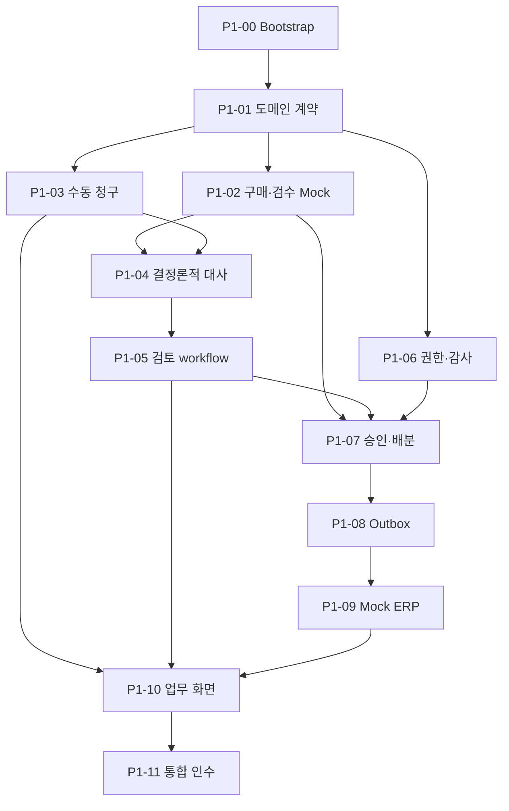

# Invoice Match 구현 계획

문서 상태: **Phase 2 완료 · Phase 3 실제 품질 평가 대기 · Phase 4 완료**
작성일: **2026-09-25**
최신화: **2026-10-05**
기준 문서: [`Spec.md` 1.1-confirmed](./Spec.md)  
실행 방법: [`Implement.md`](./Implement.md)

업무 범위, 용어, 상태, 불변식과 책임 경계는 `Spec.md`를 따른다. 이 문서는 Phase별 목표와 현재 Ticket의 구현·인수 계약을 정의한다. 완료 Ticket은 상태와 후속 진입점만 남기며 구현·검증 경과는 코드/Git/ignored output에서 확인한다.

## 1. Phase 1~5 로드맵

| Phase | 목표 | 핵심 산출물 | 완료 기준 |
|---|---|---|---|
| 1 — AI 없는 업무 코어 | 수동 입력으로 핵심 업무 불변식과 끝단 흐름 검증 | Spring core, PostgreSQL, 구매 Mock, 결정론적 대사, 검토/RBAC/감사, 동시 배분, 지급요청 Outbox, Mock ERP, 얇은 Next.js UI | 정상·5개 예외·보완·거절·승인·인계를 재현하고 동시 승인에서도 초과 배분 0건 |
| 2 — 문서와 비동기 처리 | 파일 접수와 느린 작업·외부 장애 격리 | MinIO, presigned upload, PDF/Excel parser, 원본 미리보기·다운로드, PDF 표준 인쇄, AnalysisRun, RabbitMQ, retry/DLQ, 운영 화면 | worker/broker 중단과 중복 메시지에도 사건 유실·업무 중복 없음 |
| 3 — AI 추출·매핑·근거 | 비정형 해석을 구조화하고 품질 측정 | Document/Item Mapping/Evidence/Resolution agent, 읽기 전용 도구, pgvector, schema validation, 평가셋 | 비-AI 기준선 대비 품질·비용·지연·실패 유형 제시 |
| 4 — Human-in-the-loop | 사람 대기와 재개를 안전하게 모델링 | LangGraph checkpoint, mapping interrupt, 새 증빙 재분석, resume 멱등성, stale 차단 | worker/message 점유 없이 정확한 version만 재개·반영 |
| 5 — 최적화·장애 시연·포트폴리오 | 측정 가능한 개선과 재현 가능한 설명 완성 | 조회·인덱스 실험, 부하·경합·장애 주입, ERP 대사, 관측성, README/ERD/보고서 | 5~7분 시연, Docker Compose 재현, 성능·AI 평가 결과와 trade-off 설명 |

Phase 1~2와 Phase 3 구현·자동 통합 인수, Phase 4 P4-00~07은 완료했다. 실제 제공자 품질 평가, 최신 원격 CI, PC 인쇄 미리보기와 사람의 5~7분 시연은 별도 확인 항목으로 유지한다. 격리 provider fixture의 내구성 검증은 실제 AI 품질 인수를 대신하지 않는다. Phase 5는 자동 착수하지 않으며 착수 검토 때 상세화한다.

### 후속 설계 결정·보류 (2026-10-01)

- **문서 인식:** Azure Document Intelligence의 `prebuilt-invoice`, F0로 시작한다. 자체 OCR 서버의 자원·운영 부담과 초기 비용을 줄이는 선택이며, 한국어 청구서의 품목·수량·단가 정확도는 실제 샘플로 검증한다. F0 adapter와 admission은 P3-01에서 구현했다. API 준비 전에는 비활성화하고 실제 품질은 미측정으로 남긴다. 한도 초과 시 유료 전환을 자동으로 가정하지 않는다.
- **품목 확인의 한계:** 제출 성공은 품목명과 내부 품목의 의미가 일치한다는 보장이 아니다. A3 품목에 A4 품목 ID를 지정해도 수치 비교만으로 의미 오류를 검출할 수 없다. 향후 원문 품목명과 선택한 내부 품목을 함께 확인하게 하며, 이름의 단순 문자열 일치나 AI 추천만으로 매핑을 확정하지 않는다. 구체적인 선택·확인 UX와 검증 정책은 미확정이다.
- **식별자 입력:** 공급사·발주 검색/선택은 OCR과 별개의 개선이다. 공급사마다 양식이 달라도 문서에서 읽은 명칭·번호를 내부 공급사·발주 식별자로 그대로 간주하지 않는다. 검색 API와 선택 UX는 아직 착수하지 않는다.
- **인증:** 현재 시연용 인증을 실사용 인증으로 확정하지 않는다. 서버 세션과 JWT Access/Refresh Token 회전 방식을 비교했으나 채택은 보류한다. 단일 기업용 서비스의 전용 계정 로그인을 기준으로 검토하며 SSO·Redis 도입을 필수 전제로 두지 않는다.

### Phase 2+ 인계 계약 (Phase 1 동결 인터페이스)

Phase 2는 문서·비동기 처리(오브젝트 스토리지, presigned 업로드, PDF/Excel 파서, 원본 미리보기/다운로드/인쇄, `AnalysisRun`, RabbitMQ, 제한 재시도/DLQ, 운영 재처리)만 담당한다. AI 추출·매핑·근거(pgvector·평가셋)는 Phase 3, LangGraph checkpoint·human-in-the-loop 재개는 Phase 4, 최적화·관측성은 Phase 5다.

Phase 1이 동결한 인터페이스는 다음이며 Phase 2+가 조용히 바꾸지 않는다.

- 승인 대상은 `ReviewSnapshot`이다. 새 스냅샷은 canonical `review-snapshot-v2`(객체 key 재귀 정렬, 배열 순서 보존)이고, 이미 발급된 `review-snapshot-v1`은 재작성하지 않는다. 검증은 저장된 `schemaVersion`이 지정한 **단일** 알고리즘으로만 수행하며 v1↔v2 fallback은 없다(missing/unknown은 fail-closed, v1로 재구성 불가능한 스냅샷은 `409 REVIEW_STATE_CONFLICT` 후 v2로 재-freeze).
- `EvidenceBundle`(id/version/hash)과 canonical `match-result-v3` payload가 대사 기준선이다. AI 결과는 검토 자료로만 붙고 승인 효력을 갖지 않는다.
- 승인은 `ReviewSnapshot` + `ReceiptAllocation` + APPROVED `ReviewDecision` + `PaymentRequest` + Outbox + audit을 한 트랜잭션으로 처리하며, 검수 잔량을 초과 배분하지 않는다.
- Outbox 이벤트 계약(`PaymentRequestExportRequested`)과 외부 키(export idempotency key = `paymentRequestId:exportVersion`, webhook dedup = `provider + externalEventId`)를 유지한다. `RESULT_UNKNOWN`은 blind 재전송하지 않고 서명 결과가 같은 키로 한 번 수렴시킨다. `ACKNOWLEDGED`는 ERP 인계 접수이며 실제 송금이 아니다.
- actor-scoped idempotency `(scope, resource_key, actor, requestId)`와 서버 파생 actor/audit을 유지한다.
- `POST /api/invoice-cases/{id}/revisions`는 `SUPPLEMENT_REQUIRED`에서만 허용한다. `REJECTED`는 terminal이며 재개할 수 없다.
- `Document`/`AnalysisRun`/`Proposal`과 분석 실행 상태(`QUEUED→RUNNING→…`)는 Phase 1에 없다.

## 2. Phase 1 Backlog

### P1-00 — 저장소와 실행 기준선

**상태: 완료.** 업무 범위·불변식은 Spec과 Phase 2+ 동결 인터페이스를 따른다.

### P1-01 — 도메인 계약과 DB 기준선

**상태: 완료.** 업무 범위·불변식은 Spec과 Phase 2+ 동결 인터페이스를 따른다.

### P1-02 — 구매·검수 Mock과 로컬 Snapshot

**상태: 완료.** 업무 범위·불변식은 Spec과 Phase 2+ 동결 인터페이스를 따른다.

### P1-03 — 수동 청구와 증빙 묶음 Versioning

**상태: 완료.** 업무 범위·불변식은 Spec과 Phase 2+ 동결 인터페이스를 따른다.

### P1-04 — 결정론적 3-way 대사

**상태: 완료.** 업무 범위·불변식은 Spec과 Phase 2+ 동결 인터페이스를 따른다.

### P1-05 — 검토·매핑·보완·거절

**상태: 완료.** 업무 범위·불변식은 Spec과 Phase 2+ 동결 인터페이스를 따른다.

### P1-06 — 역할 권한과 감사이력

**상태: 완료.** 업무 범위·불변식은 Spec과 Phase 2+ 동결 인터페이스를 따른다.

### P1-07 — 원자적 승인과 동시 배분

**상태: 완료.** 업무 범위·불변식은 Spec과 Phase 2+ 동결 인터페이스를 따른다.

### P1-08 — 지급요청과 최소 Transactional Outbox

**상태: 완료.** 업무 범위·불변식은 Spec과 Phase 2+ 동결 인터페이스를 따른다.

### P1-09 — Mock ERP와 Webhook 멱등성

**상태: 완료.** 업무 범위·불변식은 Spec과 Phase 2+ 동결 인터페이스를 따른다.

### P1-10 — 조회 API와 최소 업무 화면

**상태: 완료.** 업무 범위·불변식은 Spec과 Phase 2+ 동결 인터페이스를 따른다.

### P1-11 — Phase 1 통합 인수

**상태: 완료.** 업무 범위·불변식은 Spec과 Phase 2+ 동결 인터페이스를 따른다.

## 3. Phase 2 Backlog

### P2-00 — 비공개 문서 저장소 실행 기준선

**상태: 완료.** 비공개 MinIO 실행 기준선. 이미지·설정은 `infra/minio/`와 `compose.storage.yaml`이 기준이다.

### P2-01 — Document 접수와 presigned 업로드

**상태: 완료.** 문서 접수·presigned 업로드·원본 등록. 후속 진입점은 `core-api/document/application/DocumentService`다.

### P2-02 — 제출 문서 증빙 동결과 보완 참조 보존

**상태: 완료.** 문서 증빙 동결·보완 참조 보존. 후속 진입점은 `InvoiceCaseWriteService`와 `EvidenceBundleHasher`다.

### P2-03 — 권한 있는 원본 조회와 PDF 미리보기·다운로드

**상태: 완료.** 권한 있는 다운로드와 PDF 미리보기. PC 인쇄 미리보기의 사람 확인은 별도 대기다.

### P2-04 — 제한된 자원의 PDF text layer·XLSX 구조 파서

**상태: 완료.** Linux process 격리 PDF/XLSX parser. 한도·wire·설치 실행은 `ai-worker/`와 Spec 15절을 따른다.

### P2-05 — AnalysisRun과 분석 요청 transactional Outbox

**상태: 완료.** 제출 transaction의 AnalysisRun·분석 Outbox 예약. 후속 진입점은 `AnalysisRequestService`다.

### P2-06 — 분석 요청 RabbitMQ publisher relay

**상태: 완료.** RabbitMQ confirm·lease relay. `RabbitAnalysisRequestPublisher`는 plain TCP 전용이며 TLS 도입 시 socket 소유 경계를 재검토한다.

### P2-07 — 분석 실행 claim과 문서별 결과 멱등 반영

**상태: 완료.** core-api 실행 lease·기계 인증·문서별 멱등 결과 반영을 인수했다. Python consumer와 원본 접근 연결은 P2-08에서 이어간다.

후속 Ticket은 현재 [기계 API](../core-api/src/main/java/com/invoicematch/core/analysis/api/AnalysisRunController.java), [실행 서비스](../core-api/src/main/java/com/invoicematch/core/analysis/application/AnalysisExecutionService.java), [결과 validator](../core-api/src/main/java/com/invoicematch/core/analysis/application/AnalysisResultValidator.java)를 계약 진입점으로 사용한다. API/schema·검증 수치는 여기 복제하지 않는다.

### P2-08 — Python consumer와 실행 권한 기반 원본 접근

**상태: 완료.** Python consumer·실행 권한 기반 원본 접근·설치 이미지·실제 서비스 통합 인수를 완료했다. 후속 진입점은 `ai-worker/application/execution.py`, `RabbitConsumer`, `AnalysisSourceService`와 `scripts/verify-p2-08.mjs`다. 재시도 예약 전 장애는 ACK 없이 fail-stop하며, 이 한계는 P2-09에서 해소한다.

### P2-09 — 제한 재시도와 영속 실패 이력·DLQ

**상태: 완료.** DB 실패 checkpoint·제한 실행 재시도·recovery relay·confirm DLQ를 인수했다. `AnalysisRecoveryService`와 `AnalysisRecoveryStore`가 후속 진입점이다. 동일 eventId와 immutable 부분 결과를 유지하며 core/auth 장애로 checkpoint를 저장하지 못하면 ACK 없이 중단한다. broker 발행 예약은 연결 복구까지 보존한다.

### P2-10 — 운영자 분석 조회·재처리

**상태: 완료.** 운영자 페이지 목록·실패 이력·수동 재처리와 감사/멱등 계약을 인수했다. `AnalysisOperationsService`가 후속 진입점이다. 재처리는 현재 DEAD_LETTERED에만 추가 3회 예산을 주며 기존 결과·실패 이력·eventId를 보존한다. `/operations/analysis`는 서버 자료를 조회하고 결과 불명 시 동일 요청을 재확인한다.

### P2-11 — 만료 임시 업로드 정리

**상태: 완료.** opt-in 정리와 lease ledger를 인수했다. `DocumentCleanupService`가 후속 진입점이다. 예약 만료 후 기본 24시간(최소 1시간)을 지난 정확한 임시 경로만 삭제하며 원본·등록 metadata·동결 참조를 보존한다. 실패 backoff와 옛 token fencing을 유지하고 S3/원본 orphan 탐색은 하지 않는다.

### P2-12 — 페이즈2 통합 인수

**상태: 완료.** 전체 회귀와 실제 broker 중단·worker 강제 종료·lease 복구·중복·부분 결과·DLQ·운영 재처리를 인수했다. 후속 진입점은 `scripts/verify-p2-08.mjs`다. 임시 검증 자원은 회수했다.

원격 CI 결과와 PDF 인쇄 버튼→PC 인쇄 미리보기는 사용자 요청에 따라 별도 일괄 확인한다. 프린터 출력은 인수 조건이 아니다. Azure 스캔 OCR·AI 추출/매핑·근거는 Phase 3에서 다룬다.

## 4. Phase 3 Backlog

Phase 3의 **P3-00~P3-09** 구현과 자동 통합 인수는 Head가 완료했다. P3-09의 실제 제공자 품질 평가와 사람 검수는 대기 중이다. Spec 8·9·18·24.3절과 아래 계약을 따르며 구현 세부 목록·실행 로그는 복제하지 않는다.

### 공통 계약

- AI는 처리 제안이다. 원본·수동 입력·P2 파서 결과·대사 결과를 변경하지 않으며 매핑 확정·승인·배분·지급 Tool을 제공하지 않는다. 사람의 기존 업무 action만 업무 효력을 갖는다.
- 현재 증빙의 파서 성공과 사람이 실행한 최신 대사 결과가 준비된 뒤 OPERATOR가 분석을 예약한다. 같은 증빙이라도 새 대사·매핑·구매 snapshot은 새 입력이다. 제안은 증빙/대사/구매 hash와 매핑 watermark에 묶고, 현재성과 저장된 출처를 서버가 검증한다.
- P2의 `document-parser-v1` wire/결과와 승인 API는 보존한다. AI 실행은 별도 `ai-review-v1` 작업과 RabbitMQ routing으로 격리한다. DB 예약·실행 lease·단계 결과·호출 예산을 보존하고 중복 전달에는 동일 결과를 재생한다. 외부 모델 호출 exactly-once는 주장하지 않는다.
- application은 권한·검증·예산·transaction orchestration, persistence는 SQL·잠금·조건부 저장, infrastructure는 SDK/HTTP/broker/process를 맡는다. domain은 바깥 계층에 의존하지 않는다. Head가 실제 diff를 검수하고 새 architecture scanner는 만들지 않는다.
- AI는 기본 비활성화다. 모델/provider/인증/요금 단가는 환경 설정이며 특정 모델이나 유료 전환을 가정하지 않는다. live OCR/LLM 평가는 사용자가 준비한 설정과 비용 한도에서만 실행한다. mock/offline 통과를 실제 AI 정확도로 보고하지 않는다.
- 단일 시연 회사의 정책 scope를 서버에서 고정한다. 계약과 발주 연결, 공급사, 문서 version, 유효 기간, 읽기 권한을 검색 전에 적용한다. 청구서에서 추출한 계약번호·날짜만으로 scope를 넓히지 않는다. 적용일은 Asia/Seoul 기준 동결 제출일이며 실제 계약 적용 기준이 다른 경우 확정된 계약 metadata로 바꾼다.
- 반복·도구·입출력 토큰·응답 크기·전체 wall time은 유한하다. 성공한 단계는 immutable checkpoint로 재사용하고, 불확실한 외부 호출도 예약 예산을 소비한다. 초과/근거 부족/충돌은 검토 필요 상태로 끝낸다.

### P3-00 — AI 실행과 immutable 처리 제안 계약

**상태: 완료.** 검증된 parser·최신 대사에 묶인 AI 예약/context·실행 lease·누적 호출 예산·immutable 저장 계약을 인수했다. 권한·replay·동시성·감사 rollback·실제 lease 만료·stale·DB 제약은 실제 PostgreSQL로 검증했다. `ProposalService`, `ProposalExecutionService`가 진입점이며 기계 endpoint와 단계별 validator 연결은 P3-07에서 완료했다.

### P3-01 — Azure 스캔 OCR adapter

**상태: 완료.** F0 admission·고정 origin binary submit/poll·provider 오류·시간/응답 한도와 page/span/좌표 검증 adapter를 인수했다. `RecognizeInvoice`와 `AzureInvoiceRecognizer`가 후속 진입점이다. 실제 local HTTP 및 설치된 Linux wheel로 검증했으며 live Azure 정확도·비용은 설정 제공 후 별도 평가한다. 원본 접근/consumer 연결은 P3-07이다.

### P3-02 — Document Agent와 구조·숫자·출처 검증

**상태: 완료.** 원문 위치와 숫자·날짜 normalization을 검증하는 후보 추출 및 제한된 repair를 인수했다. `DocumentAgent`, `ChatStructuredModel`, `ProposalStageValidator`가 후속 진입점이다. Core가 출처·값·schema·예산을 독립 검증하며 성공 단계는 immutable checkpoint로 재생한다. 실제 모델 품질 평가는 P3-09에서 별도 수행한다.

### P3-03 — 사건 범위 읽기 전용 Tool

**상태: 완료.** `ProposalToolService`가 동결된 사건 자료와 승인된 과거 매핑만 제공하며 요청별 결과·호출 예산을 보존한다. 계약 metadata는 P3-04의 적용 scope를 사용한다. 기계 endpoint·인증 연결은 P3-07에서 완료했다.

### P3-04 — 정책 catalog와 exact pgvector hybrid 검색

**상태: 완료.** 권한 있는 immutable catalog 등록과 회사·공급사·발주·유효일·최신 버전·읽기 권한을 적용한 lexical/exact vector/hybrid 검색을 인수했다. `PolicyCatalogService`, `PolicySearchService`, `ProposalCurrentness`가 후속 진입점이다. 명시적 허용/금지 metadata 충돌과 근거 없음을 구분하며 본문 의미 충돌은 Evidence/Resolution에서 검토한다. 모델/version/dimension과 정책 version을 입력에 묶고 scope publication 경합을 잠금으로 직렬화한다. 실제 pgvector와 일반 PostgreSQL의 AI-off 회귀를 검증했으며 실제 embedding 품질 평가는 P3-09에서 수행한다.

### P3-05 — Item Mapping Agent

**상태: 완료.** `ItemMappingAgent`와 `ProposalMappingValidator`가 서버 후보 ID·원문 위치·승인된 과거 매핑을 검증한다. 규격 차이·복수 후보·후보 없음은 사람 검토를 요구하며 빈 추출은 모델을 호출하지 않는다. Recall@1/3 evaluator는 실패/누락을 포함해 계산하고 실제 모델 품질 측정은 P3-09에서 수행한다. 업무 입력·매핑·배분·지급은 변경하지 않는다.

### P3-06 — Evidence/Resolution Agent

**상태: 완료.** 검증된 대사 예외와 검색 근거로 보완요청·승인검토·거절검토 초안을 만든다. 근거 ID/version/page/paragraph/quote를 저장된 적용 문단과 대조한다. 무근거·충돌에는 `INSUFFICIENT_EVIDENCE`/`REVIEW_REQUIRED`를 요구하고 금액·잔량은 코어 사실을 인용한다. 결론을 업무 상태로 반영하지 않는다.

인수: 가짜 citation, 구버전 정책, 잘못된 수치, 근거 없음/충돌, prompt injection과 무단 Tool 거부. 동일 입력의 canonical hash/replay 보존.

### P3-07 — AI consumer와 복구·예산 연결

**상태: 완료.** 위 단계들을 제한된 실행 순서로 연결하고 별도 RabbitMQ queue의 prefetch=1/manual ACK를 사용한다. 단계마다 lease/currentness를 재확인하고 성공 checkpoint는 재사용한다. 요청 예약이 전달 전 장애에도 보존되고, 중단·응답 유실·중복·외부 실패는 제한 실행 예산과 durable checkpoint로 수렴한다. 장시간 사람 대기/graph resume는 P4다.

인수: 실제 broker/Core/설치 worker에서 checkpoint 후 종료, 모델 응답/최종 저장 응답 유실, lease reclaim, 429/timeout/소진, 중복 완료와 stale 차단. 외부 호출·tool/token budget은 재claim에도 초기화하지 않는다.

### P3-08 — AI 검토 화면과 선택적 freeze

**상태: 완료.** 기존 사건 상세에 추출 후보·품목 후보·근거·초안·분석 상태/실행 출처를 보여준다. 예약은 OPERATOR만 가능하고 기존 사람 action을 사용한다. 현재 제안만 새 ReviewSnapshot의 선택적 근거로 동결하며 승인 검증은 snapshot에 들어간 정확한 Proposal/hash를 재구성한다. 제안이 없는 기존 v1/v2 snapshot과 승인 API의 동작/hash를 보존한다.

인수: 실제 서비스/브라우저에서 정상·없는 제안·실패·stale·보완/새 매핑, 늦은 응답/세션 교체. 실제 PostgreSQL 승인 forged proposal/다른 사건/hash 변조 거부와 legacy 승인 회귀. 인쇄/remote CI는 기존 사용자 확인 항목이다.

### P3-09 — 평가와 Phase 3 통합 인수

**상태: offline 기준선·자동 통합 인수 완료 · 실제 품질 평가 대기.** 현재 고정 평가셋은 64개 합성 사례이며 사람 검수와 live OCR은 미수행이다. API 설정 제공 후 사람이 작성·수정한 표현을 검수하고 동일 사례의 비-AI 기준선과 configured AI를 비교한다. text/cell/OCR·품목·검색·처리 제안의 gold를 분리하며 field/numeric/location 정확도, Recall@1/3/k·version, 기대 분기·무근거 주장, 호출/토큰/재시도·latency/요금 단가 기반 비용을 측정한다. 현재는 offline contract/기준선만 공개하고 AI 품질·비용·사람 검토시간은 미측정으로 남긴다.

인수: backend 전체 test/bootJar, Web lint/test/build, 실제 Linux worker/wheel/CLI, 실제 pgvector/broker 연결 및 AI 오류 회귀. code-verifiable 설명을 늘리지 않고 기존 Spec/Plan/README와 의미 있는 EngineeringNotes만 갱신한다. 실제 AI 품질이 채택 기준을 충족하기 전 기본 활성화하지 않는다.

## 5. Phase 4 Backlog

Phase 4는 **P4-00~P4-07**을 순차 인수한다. Head가 계약·검수·통합을 맡고 구현은 격리된 Worker에 위임한다. 기존 Spec 8.3·14절과 Phase 3의 출처·예산·선택적 freeze 계약을 따른다. 구현 목표는 사람이 검토하는 동안 process와 메시지를 점유하지 않고, 저장된 정확한 입력에만 재개를 적용하는 것이다.

### 공통 계약

- 기본 비활성인 새 graph workflow를 기존 `document-parser-v1`·`ai-review-v1`과 분리한다. 기존 완료 Proposal, checkpoint, hash와 승인 동작을 재작성하지 않는다. graph 기능이 꺼져 있어도 기존 실행·조회·사람 검토는 유지한다.
- graph의 흐름은 파서 결과 읽기 → 추출/매핑 후보 → 필요 시 사람 확인 → 정책 근거/처리 초안 → 검증된 제안 저장이다. 파싱·대사·매핑 확정·승인은 기존 Core가 담당한다. graph는 동결된 Core 결과를 읽으며 업무 변경 Tool을 갖지 않는다.
- LangGraph SDK·`interrupt`·`Command`·serializer·checkpointer 구현은 Python infrastructure에만 둔다. application은 SDK 독립 DTO/port로 분기·예산·검증을 담당하고 domain은 바깥 계층에 의존하지 않는다. Core application은 권한·currentness·상태·transaction, persistence는 SQL·잠금·조건부 저장을 담당한다. 기존 architecture test와 Head diff 검수를 사용한다.
- graph checkpoint도 인증된 Core 기계 API를 통해 PostgreSQL에 저장한다. worker에 DB 자격증명이나 임의 SQL 권한을 주지 않는다. SDK checkpoint와 pending writes의 저장 형태는 P4-00에서 실제 SDK로 검증하며 별도 DB·LangGraph Platform·LangSmith·Redis는 추가하지 않는다.
- thread는 서버가 발급한 graph 실행 ID에 1:1로 묶는다. 입력에는 사건·증빙·파서·대사·구매·정책/매핑 watermark와 hash, graph/schema/version을 고정한다. 다른 사건·thread·checkpoint를 지정한 재개나 클라이언트가 제출한 임의 graph state를 거부한다.
- 사람 대기는 `WAITING_HUMAN`으로 저장한다. checkpoint·interrupt 참조·대기 상태가 모두 영속화된 후에만 ACK하며 lease·heartbeat·consumer 호출은 종료한다. 대기 시간은 실행 timeout·재시도 횟수를 소비하지 않는다. 대기 중 broker/worker 재시작만으로 resume를 발행하지 않는다.
- 같은 입력에서의 사람 확인만 같은 thread를 재개한다. 실제 품목 매핑은 기존 `ReviewService`의 사람 action으로 확정한다. 이 action은 사건 version 증가·재대사·후속 snapshot 동결을 이미 수행하므로 worker가 다시 실행하지 않는다. 입력이 바뀌면 옛 thread는 STALE이며 새 입력으로 별도 실행을 예약한다.
- 새 증빙은 기존 보완 작성·제출·P2 parser 성공·최신 대사를 거친다. 옛 thread에 새 파일·context를 끼워 넣지 않는다. 새 실행은 이전 실행과 successor 관계만 보존하며 이전 성공 단계를 다른 입력의 결과로 가장하지 않는다.
- 확인 대상은 한 번에 필요한 문서/품목 후보를 묶은 단일 interrupt로 제한한다. 같은 입력의 반복 사람 확인 loop는 만들지 않는다. 추출값 확인은 참고 자료이며 수동 청구 입력을 바꾸지 않는다. 금액·수량·원문 위치·후보 ID는 Core가 다시 검증한다.
- 한 thread는 최초 실행과 사람 재개 두 구간만 허용한다. 각 구간 최대 3회 실행, thread 전체 최대 6회이며 호출 5회·토큰 40,000·Tool 8회·configured 비용 상한은 thread 전체에서 누적한다. 대기·재개·새 프로세스가 예약 예산을 초기화하지 않는다. 새 입력의 successor는 명시적인 OPERATOR 예약으로만 새 예산을 부여한다.
- graph checkpoint는 업무 승인 근거 자체가 아니다. 최종 제안은 Core가 원문·수치·사람 확인·정책 근거를 재검증해 별도 immutable payload로 완성하고, 승인자는 기존 화면에서 정확한 Proposal/hash를 선택해 freeze한다. 최종 승인·배분·지급은 graph 밖에 유지한다.

### P4-00 — graph 영속화와 버전 계약 확정

**상태: 완료.** 실제 pin한 SDK의 interrupt·새 프로세스 복원·재개와 성공 단계/예약 보존을 인수했다. Spec 8.3·14절에 Core 업무 경계·상태·재개 identity·누적 예산·ACK·버전 정책을 확정했다. 후속 진입점은 `application/graph_contract.py`, `infrastructure/graph_serializer.py`, `tests/test_graph_checkpoint.py`다. Core 저장은 P4-01에서 인수했으며 adapter·consumer 연결은 후속 Ticket이다. SDK reserved pending-write slot은 이전 hash/version을 검증한 새 불변 version으로 저장하며 기존 기록을 덮어쓰지 않는다.

### P4-01 — Core graph 상태·checkpoint·대기 저장

**상태: 완료.** 기본 비활성인 별도 graph 저장과 실행 token·currentness 검증, 불변 checkpoint/pending-write replay, 저장 상한과 원자적 사람 대기를 인수했다. 후속 진입점은 Core `GraphExecutionService`, `GraphPayloadValidator`, `GraphStore`와 V21 migration이다. 대기 후 재개는 P4-03의 불변 사람 확인 원장 없이는 허용하지 않는다. 기존 v1 입력·완료 제안·hash와 업무 흐름은 유지한다.

### P4-02 — LangGraph adapter와 durable interrupt 연결

**상태: 완료.** 기존 agent와 Core 검증을 재사용한 유한 graph, 참조 기반 SDK state, Core 대기 proof 이후 consumer 반환과 장애 복원을 인수했다. 후속 진입점은 worker `ProcessGraph`, infrastructure `LangGraphRuntime`·`GraphCoreClient`, composition `build_graph_processor`와 Core `GraphStageService`다. 실제 SDK writer에 맞춘 저장 호환성 결정은 Spec 8.3과 V22 migration을 따른다. 사람 확인·재개 원장은 P4-03, 운영 시작/resume relay·BUSY 복구는 P4-04에서 연결하며 기본 비활성을 유지한다.

### P4-03 — 사람 확인과 원자적 resume 예약

**상태: 완료.** OPERATOR의 현재 pending interrupt 확인, 불변 원장·감사·actor-scoped 멱등 응답·resume Outbox의 원자적 저장을 인수했다. 후속 진입점은 `GraphReviewService`, `GraphReviewValidator`, `GraphReviewController`, `GraphStore`와 V23 migration이다. 사람 확인은 동결한 원문·후보에 대한 의견이며 기존 업무 입력·매핑·승인을 변경하지 않는다. 저장 성공은 재개 예약이며 실제 메시지 발행·SDK 재개는 P4-04, 화면 연결은 P4-06에서 수행한다. 이전 시작 메시지는 resume 구간을 claim할 수 없다.

### P4-04 — resume relay·consumer·제한 복구

**상태: 완료.** 시작/resume 전용 relay·consumer, 정확한 불변 identity의 재개와 ACK 전 durable 복구 책임 저장을 인수했다. 후속 진입점은 Core `GraphDeliveryService`·`GraphDeliveryStore`, worker `ProcessGraph`·`LangGraphRuntime`과 graph Compose profile이다. 사람 payload는 인증된 Core에서 읽으며 구간별 제한 재시도와 누적 예산을 유지한다. 정확한 대기 checkpoint에 재개 명령을 적용하고, 이미 저장된 사람 노드 출력은 현재 head에서 이어가 SDK의 과거 checkpoint 재실행을 피한다. 기본 비활성을 유지하며 업무 변경과 successor 연결은 P4-05에서 수행한다.

### P4-05 — 매핑·보완 successor와 stale 경합

**상태: 완료.** 같은 사건의 업무 변경과 옛 실행·미발행 재개의 취소, 정확한 currentness fencing, 명시적 OPERATOR successor 예약을 인수했다. 후속 진입점은 `GraphInvalidationService`, `GraphExecutionService.successor`, `GraphStore`와 V25 migration이다. successor는 변경된 입력과 새 실행 예산을 사용하며 provenance만 연결한다. 파서 성공·최신 대사가 없으면 예약을 거부하고 기존 수동 검토는 유지한다.

공유 구매·정책 변경은 다른 사건의 잠금을 잡아 일괄 취소하지 않는다. 잠금 역전을 피하면서 다음 Core 동작에서 최신성을 확인하고 저장·완료를 차단한다. P4-06 조회에도 같은 경계를 적용하며, 화면의 상태 계산으로 최신성을 대신하지 않는다.

### P4-06 — 사람 확인 UI와 대기·재개 이력

**상태: 완료.** 의존: P4-03~05. 기존 사건 상세의 AI 패널에 대기 사유·원문 위치·후보·확인 기록·재개 상태를 표시한다. OPERATOR는 후보/원문을 확인하고 확인 값/사유를 저장한다. 실제 품목 변경은 기존 매핑 action으로 이동하며 새 대사 후 successor 예약을 안내한다. 보완은 기존 사람 보완/제출 action을 사용한다.

조회 계약은 [GraphViews](../core-api/src/main/java/com/invoicematch/core/analysis/application/GraphViews.java)를 사용한다. Core가 동결 원문·후보와 정확한 대기 참조를 투영하며 checkpoint body·lease token·SDK 상태는 브라우저에 노출하지 않는다. OPERATOR·APPROVER만 사건 권한 안에서 조회하고, 기본 비활성에서도 기존 이력은 보존한다. 지원하지 않는 저장 버전은 metadata만 보여 주며 자동 복원하지 않는다. 공유 입력 변경은 조회 transaction의 기존 currentness 잠금 경계에서 STALE 및 미발행 취소를 확정한다. 완료된 graph 제안은 기존 선택적 freeze 계약을 사용한다.

기존 v1 제안 검증과 graph 결과 검증은 저장 경계가 다르므로 선택한 ID의 실제 저장 출처에 따라 검증한다. graph 완료 결과를 동결할 때에도 같은 사건·증빙·대사, currentness, 동결 단계 재구성과 정확한 사람 확인 소비를 검증한다. 완료 저장과 freeze 검증은 같은 graph 조립 경계를 공유하며 v1 결과·snapshot hash·승인 동작은 유지한다.

확인 저장 중·저장됨/재개 대기·재개 실행·완료/실패·stale을 구분한다. 응답 불명에는 같은 intent/requestId/body를 유지하고 임의 재확인을 새 요청으로 만들지 않는다. session/case/interrupt/version 교체와 늦은 조회 응답은 기존 abort/generation 방식으로 차단한다. 모델 텍스트는 escape하고 브라우저가 계산/권한/최신성을 확정하지 않는다. 승인자는 완성된 제안만 기존 선택적 freeze로 편입한다.

인수: 역할별 화면·후보 없음/모호함·단일 확인·응답 유실 재시도·늦은 응답/세션 교체 테스트. 실제 브라우저에서 확인 저장 → worker 중단/재시작 → 재개 완료, 매핑 변경 → stale/successor, AI-off 기존 검토·승인 흐름을 확인한다.

### P4-07 — Phase 4 통합 인수

**상태: 완료.** 의존: P4-00~06. 기존 검증 harness를 확장해 격리 Core/PostgreSQL/RabbitMQ/설치 Linux worker와 실제 LangGraph를 사용한다. 모델 fixture는 품목 모호함과 정상/오류를 결정적으로 재현하고 live 제공자 품질 검증과 구분한다.

인수: 여러 사건 중 하나만 사람 대기, 대기 상태에서 모든 worker 종료 후 복원, 동일/역순 resume, checkpoint/사람 저장/confirm/완료 응답 유실, lease 회수, 실패 소진·누적 예산, 새 매핑/증빙/정책 경합과 오래된 승인 근거 거부. backend 전체 test/bootJar, Web lint/test/build, 실제 Linux wheel/CLI·broker·pgvector 회귀와 브라우저 흐름을 통과한다. 자신이 만든 자원은 성공/실패 모두 회수한다.

완료 후 기존 Spec/Plan/README를 필요한 만큼만 갱신한다. 새로운 설계 결정이 생겼을 때만 관련 ADR을 작성하고 EngineeringNotes에는 의미 있는 원인·선택·교훈만 남긴다. P3-09 실제 품질 평가·원격 CI·PC 인쇄 미리보기·사람 시연 대기는 별도로 유지한다. Phase 5를 자동 착수하지 않는다.

공식 SDK 참고: [interrupt와 노드 재실행](https://docs.langchain.com/oss/python/langgraph/interrupts), [checkpoint persistence](https://docs.langchain.com/oss/python/langgraph/persistence). 구현 때 pin한 버전의 API와 실제 저장·복원 동작을 다시 확인한다.

## 6. Ticket 의존성

Phase 4 순서: P4-00 → P4-01 → P4-02 → P4-03 → P4-04 → P4-05 → P4-06 → P4-07. P3-09 live 평가 대기는 AI 기본 비활성 상태의 Phase 4 구현을 막지 않는다.

## 7. 유지보수 Ticket

### R1-01 — 백엔드 3계층/클린코드 정리

**상태: 완료.** 책임 분리의 이유는 기존 EngineeringNotes에 남기고 구현·검증 목록은 코드와 Git에서 확인한다.

### R1-02 — main CI IntegrationTest 실패 조사·복구

**상태: 완료.** 테스트와 애플리케이션의 webhook secret 설정 우선순위를 바로잡았다. 사용자가 해당 CI 통과를 확인했다. 이후 변경의 원격 CI 결과는 사용자 요청에 따라 일괄 확인한다.

### UI-01 — 기존 업무 디자인의 Tailwind·shadcn/ui 전환

**상태: 완료.** Phase 5와 별개의 사용자 요청이다. 디자인 기준은 `DESIGN.md`를 따른다.

- 밝은 업무 도구 컨셉과 기존 팔레트를 유지한다. 주요 연두색 버튼의 색상 변경은 이 작업에 포함하지 않는다. 글자·컨트롤 크기는 `DESIGN.md`의 시각 기준을 따르고 긴 표는 자체 가로 스크롤을 제공한다.
- Tailwind v4 테마를 shadcn의 의미 기반 색상 토큰으로 정리하고 공식 new-york(Radix) 컴포넌트 소스를 현 디자인에 맞게 적용한다. 버튼·입력·텍스트 영역·배지·표를 공통 컴포넌트로 사용한다. 네이티브 select·checkbox, 기존 아이콘은 동작 보존에 유리한 경우 유지한다.
- `web`의 모든 업무 화면과 공용 UI를 전환한다. 기존 globals/screens CSS의 화면·컨트롤 선언을 JSX 유틸리티와 공통 컴포넌트로 옮기고 불필요해진 선언을 제거한다. 테마·기본 요소 초기화·애니메이션·브라우저/PDF 특수 처리만 CSS에 남긴다. Preflight는 도입하지 않는다.
- URL 탭, 역할별 동작, API 요청·재시도·버전 검증, 폼 제출, 저장 값, 증빙·AI 원문 근거와 확인 기록을 유지한다. 개발용 해시·내부 ID를 다시 표시하지 않는다. PDF는 클릭 전 공간을 차지하지 않으며 열면 데스크톱 화면 전체가 폭을 줄이는 상단·우측 서랍으로 유지한다.
- Java/Python/API 계약·업무 흐름은 변경하지 않고 shadcn lint의 새 규칙을 켜지 않는다. 검증은 기존 web lint·전체 테스트·build와 실제 브라우저의 로그인·목록·작성·상세·PDF 서랍·인계·운영 화면을 포함한다. 중지된 사용자 시연 스택은 임의 재시작하지 않는다. 격리 frontend의 API fixture 검증과 실제 서비스 검증을 구분해 보고한다.
