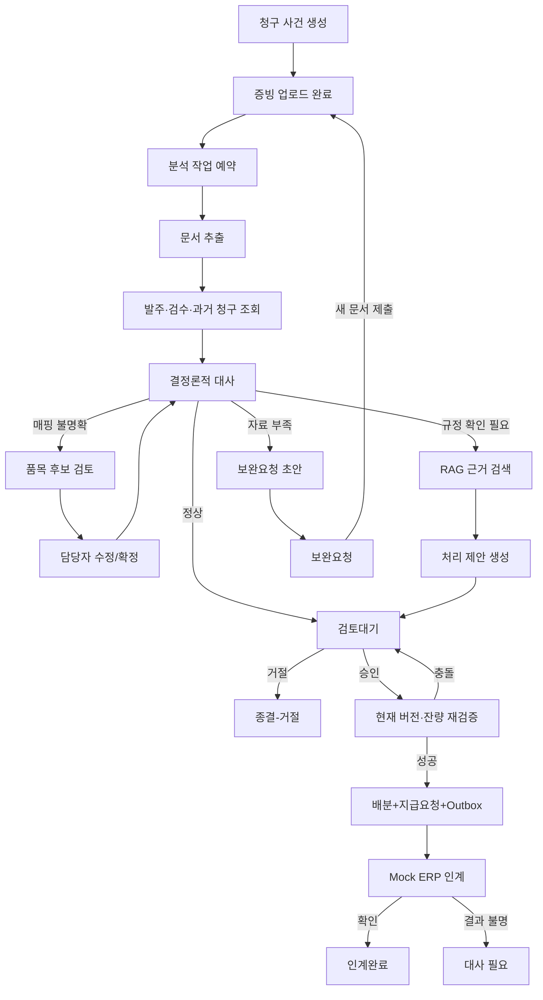
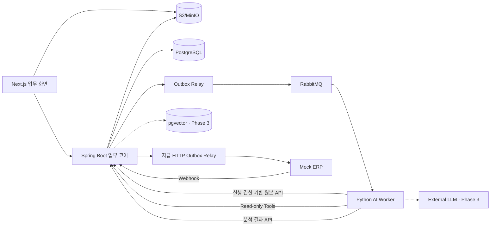

# Invoice Match 프로젝트 명세

문서 버전: **1.1-confirmed**  
작성일: **2026-09-25**  
프로젝트 성격: **SI·기업 업무시스템 백엔드 재취업 포트폴리오**  
연관 문서: [도메인 용어](./CONTEXT.md), [구현 계획](./Plan.md), [구현 런북](./Implement.md), [설계 결정](./adr/)

## 1. 한 문장 정의

발주·검수 데이터와 공급사의 매입 청구 문서를 대사하고, 불일치 사건에 대해 AI가 문서 근거와 처리안을 준비하면 담당자가 검토하여 지급요청으로 확정하는 기업용 업무시스템이다.

프로젝트의 핵심은 AI가 금액을 결정하거나 지급을 승인하는 것이 아니다. **일반 코드가 수량·단가·잔량·권한을 검증하고, AI는 사람이 오래 읽어야 하는 비정형 문서와 의미가 다른 표현을 처리한다.**

## 2. 기획 배경

매입 청구 처리에서는 발주서, 검수 기록, 청구서의 품목명과 수량이 항상 정확히 일치하지 않는다. 공급사마다 문서 양식과 품목 표현이 다르고, 분할 납품·별도 운임·허용오차 같은 조건은 계약 또는 사내 지침에 문장으로 존재할 수 있다.

기존 담당자는 다음 업무를 반복한다.

1. PDF 또는 Excel 청구 증빙에서 청구번호·품목·수량·단가를 확인한다.
2. 구매시스템에서 관련 발주와 검수 기록을 찾는다.
3. 품목명이 다르면 같은 품목인지 판단한다.
4. 수량·단가 차이가 있으면 계약과 지침을 찾아 적용 가능 여부를 검토한다.
5. 공급사에 보완을 요청하거나 승인자에게 처리안을 설명한다.
6. 승인된 결과를 회계/ERP 시스템에 다시 등록한다.

V1은 이 중 **문서 접수부터 지급요청 인계까지의 예외 처리 구간**만 구현한다.

## 3. 프로젝트 목표

### 3.1 제품 목표

- 발주·검수·청구 사이의 불일치를 일관된 규칙으로 탐지한다.
- 비정형 증빙에서 구조화 정보를 추출하고 원문 위치를 함께 제공한다.
- 품목 표현이 다르거나 계약 조건 확인이 필요한 사건에 근거 기반 처리안을 제시한다.
- 담당자가 AI 결과를 수정·승인·거절하거나 보완을 요청할 수 있다.
- 동일한 요청·메시지·webhook이 재전송되어도 업무 효과가 중복되지 않는다.
- AI 및 ERP 장애가 청구 접수와 업무 데이터의 유실로 이어지지 않는다.
- 특정 입력·모델·프롬프트·규칙으로 만들어진 결과인지 추적할 수 있다.

### 3.2 포트폴리오 목표

- Spring Boot 기반 업무 규칙, 트랜잭션, 잠금, JPA 조회 최적화를 보여준다.
- Python·LangGraph·RAG·Tool Calling·Human-in-the-loop를 실제 업무 흐름에 적용한다.
- RabbitMQ, Outbox, Retry, DLQ, 멱등 소비를 장애 시나리오와 함께 설명한다.
- AI가 작성한 코드를 검증할 수 있도록 도메인 규칙, 테스트, 평가셋과 설계 결정을 문서화한다.
- 5~7분 시연에서 정상 처리, AI 예외 처리, 동시성 충돌, 외부 장애 복구를 재현한다.

## 4. V1 범위

### 4.1 포함 범위

- 단일 회사, 단일 통화(KRW), 물품 구매
- 외부 구매시스템의 발주·검수 조회 mock API
- 공급사 매입 청구 등록 및 PDF/Excel 증빙 업로드
- 청구서 필드 및 라인 추출
- 발주·검수·청구 3-way 대사
- 다섯 가지 예외 유형
  - 검수 수량 초과 청구
  - 발주 단가와 청구 단가 불일치
  - 공급사 품목명과 내부 품목 매핑 불명확
  - 동일 청구번호 또는 유사 증빙 재제출 의심
  - 필수 증빙 또는 판단 근거 부족
- 계약·사내 지침 RAG 검색과 출처 표시
- AI 처리 제안, 담당자 수정·승인·거절·보완요청
- 검수 잔량 배분과 지급요청 생성
- Mock ERP 지급요청 인계 및 webhook 결과 수신
- 감사이력, 작업 실패 조회, 운영자 재처리
- 대시보드용 일별 처리 통계

### 4.2 제외 범위

- 공급사 선정, 견적 비교, 입찰, 계약 체결
- 재고·창고·배송·생산계획
- 전자세금계산서 발행 및 부가세 신고
- 회계 원장, 전표 생성, 실제 송금
- 외화, 환율, 공사 기성, 용역 검수
- 실제 SAP·Oracle ERP 커넥터
- AI에 의한 자동 승인 또는 자동 지급
- 범용 BPM/워크플로 설계기
- Kubernetes, MSA, Kafka, 분산락, 샤딩
- 이미지 기반 위변조 판정 또는 법적 문서 진위 보증

### 4.3 V1 가정

- 발주 및 검수 데이터는 외부 구매시스템이 정본이다.
- 이 시스템에서 검수수량을 이미 청구에 사용한 내역은 `ReceiptAllocation`이 정본이다.
- V1의 청구 문서는 합성 데이터이며 실제 세무 효력을 갖는 문서가 아니다.
- 하나의 청구 사건은 하나의 공급사와 하나의 발주만 참조한다.
- 정상 대사 건도 최종 지급요청 생성 전에는 승인자의 승인을 받는다.
- 정산 담당자와 승인자를 분리하고 제출자의 자기 승인을 금지한다. 금액별 다단계 결재는 V1에서 제외한다.
- 계약 조건에 근거가 없거나 여러 해석이 가능하면 AI는 판단을 유보한다.
- AI가 반환한 confidence 값만으로 자동 처리 여부를 결정하지 않는다.

### 4.4 Phase 1 대사 기준선

- 물품 수량은 양의 정수, 단가는 KRW 원 단위 정수로 취급한다.
- VAT, 운임, 할인, 반품, credit memo, 소수 수량은 V1 기준선에서 제외한다.
- 수량과 단가의 허용오차는 0으로 시작한다. 허용오차 규칙은 측정 가능한 요구가 생길 때 확장한다.
- 청구수량이 남은 확정 검수수량 이하면 부분 청구를 허용한다.
- 한 청구 라인은 여러 검수 라인에 배분할 수 있으며 `검수일, 외부 검수라인 ID` 순으로 배분한다.
- 공급사와 정규화 청구번호가 같은 다른 사건이 존재하면 저장을 거부하지 않고 `DUPLICATE_INVOICE_SUSPECTED` 예외로 보낸다.
- 필수 입력 누락, 0 이하 수량, 음수 단가, 잘못된 날짜는 업무 예외가 아니라 입력 검증 오류다.
- Phase 1 수동 입력도 제출 시 수정 불가능한 `EvidenceBundle` version으로 동결한다.

## 5. 사용자와 책임

| 사용자 | 주요 책임 |
|---|---|
| 정산 담당자 | 청구 등록, 분석 결과 확인, 필드·품목 매핑 수정, 보완요청, 승인 상신 |
| 승인자 | 최신 증빙과 검수 잔량을 확인하고 지급요청 생성 승인 또는 거절 |
| 구매/검수 담당자 | 발주·검수 데이터의 사실관계 확인, 필요한 경우 정정 정보 제공 |
| 운영자 | 실패 작업·DLQ 확인, 원인 수정 후 재처리, 시스템 상태 모니터링 |
| Mock ERP | 지급요청을 멱등하게 수신하고 처리 결과를 webhook으로 전달 |

공급사 전용 포털과 공급사 사용자는 V1에 포함하지 않는다. 정산 담당자가 공급사로부터 받은 문서를 등록하는 흐름으로 단순화한다.

## 6. 핵심 사용자 시나리오

### 6.1 정상 청구

1. 정산 담당자가 발주번호를 선택하고 청구 문서를 등록한다.
2. 시스템은 파일 업로드 완료를 확인한 뒤 분석 작업을 예약한다.
3. AI worker가 청구번호·품목·수량·단가를 추출한다.
4. Spring 업무 코어가 발주·검수 데이터와 대사한다.
5. 모든 라인이 일치하면 검토대기 상태로 전환한다.
6. 승인자가 승인하면 검수 수량을 배분하고 지급요청을 생성한다.
7. Outbox를 통해 Mock ERP로 인계하고 결과를 수신한다.

### 6.2 부분 검수보다 많은 수량을 청구한 경우

발주 100개, 검수 60개, 청구 100개인 상황을 대표 예제로 사용한다.

1. 일반 코드가 현재 검수 잔량이 60개임을 계산한다.
2. AI는 계약에서 분할 납품·분할 청구 조건을 검색하고 관련 문단을 제시한다.
3. Resolution Agent가 “검수 완료 60개분으로 수정 청구 요청” 초안을 만든다.
4. 정산 담당자가 초안을 수정하여 보완요청을 확정한다.
5. 새 청구 문서가 제출되면 새로운 증빙 묶음 버전으로 재분석한다.
6. 이전 분석 결과는 구버전 결과로 남지만 현재 승인에는 사용할 수 없다.

V1에서는 청구 수량을 시스템이 임의로 60개로 변경하여 부분 지급하지 않는다. 수정된 청구 문서를 다시 받는 방식으로 제한한다.

### 6.3 공급사 품목명이 다른 경우

1. 청구 문서의 `Premium Copy Paper A4`를 내부 품목 코드에 정확히 연결하지 못한다.
2. Item Mapping Agent가 품목 master와 승인된 과거 매핑을 조회한다.
3. 상위 후보와 근거를 담당자에게 표시한다.
4. 담당자가 실제 품목을 확정하면 해당 매핑을 현재 청구에 적용한다.
5. 대사를 다시 수행한다.

새 매핑을 전사 공통 master로 승격하는 기능은 V1에서 제외한다. 현재 사건의 확정 매핑과 향후 추천용 이력만 저장한다.

### 6.4 동시 승인 충돌

같은 검수 라인의 잔량이 60개인데 서로 다른 두 청구가 각각 40개를 요청한다고 가정한다.

1. 두 승인 요청 모두 화면에서는 승인 가능해 보인다.
2. 승인 트랜잭션이 동일한 검수 잔량 행을 잠근다.
3. 먼저 처리된 요청이 40개를 배분한다.
4. 다음 요청은 최신 잔량 20개를 확인하고 승인에 실패한다.
5. 해당 사건은 재검토 상태로 전환되고 사용자에게 충돌 이유를 알려준다.

청구 사건의 `@Version`만으로는 서로 다른 사건이 공유하는 검수 잔량을 보호할 수 없으므로, 승인 시 공유 배분 자원에 대한 잠금과 재검증이 필요하다.

### 6.5 ERP 응답 유실

1. Mock ERP가 지급요청을 처리한다.
2. 응답 또는 webhook이 네트워크 문제로 유실된다.
3. Integration 모듈은 동일한 idempotency key로 처리 상태를 조회한다.
4. 이미 처리되었다면 중복 생성 없이 수신확인 상태로 바꾼다.
5. 상태 조회도 불가능하면 `RESULT_UNKNOWN`으로 남기고 무조건 재전송하지 않는다.

## 7. 업무 흐름



## 8. AI workflow 설계

### 8.1 설계 원칙

- 상용 제품의 관행은 업무 위험을 이해하기 위한 기준선으로 사용하되 제품 설계의 상한으로 보지 않는다.
- AI가 검토시간, 추출 정확도, 근거 검색 또는 예외 설명을 측정 가능하게 개선하면 기존 관행과 다른 사용자 흐름도 허용한다.
- AI workflow는 자유로운 자율 에이전트 군집보다 상태와 분기가 제한된 graph로 구성한다.
- 각 에이전트는 하나의 명확한 산출물과 JSON schema를 가진다.
- 수량·금액·잔량·권한·상태 전이는 LLM이 결정하지 않는다.
- 업무 데이터 조회 Tool은 기본적으로 읽기 전용이다.
- 최종 승인, 배분, 지급요청 생성 Tool은 LLM에 제공하지 않는다.
- 근거가 부족하면 추측하지 않고 `REVIEW_REQUIRED` 또는 `INSUFFICIENT_EVIDENCE`를 반환한다.
- 반복 횟수, Tool 호출 수, 토큰, 전체 실행시간에 상한을 둔다.

### 8.2 서브에이전트와 코드 노드

| 구성요소 | 입력 | 산출물 | 성격 |
|---|---|---|---|
| Document Agent | PDF/Excel, 문서 유형 | 청구 header·line 후보, 원문 위치, 파싱 경고 | AI/문서 처리 |
| Item Mapping Agent | 청구 품목 표현, 품목 master, 과거 확정 매핑 | 상위 매핑 후보와 근거 | AI + Tool Calling |
| Evidence Agent | 예외 유형, 계약 ID, 적용일 | 관련 계약·지침 문단과 문서 버전 | RAG |
| Resolution Agent | 대사 결과, 매핑 후보, 근거 문단 | 보완요청·승인검토·거절검토 초안 | AI |
| Schema Validator | 에이전트 출력 | 구조·필수값·범위 검증 결과 | 일반 코드 |
| Matching Engine | 발주·검수·청구 라인 | 일치·불일치와 계산 근거 | Spring 일반 코드 |
| Approval Verifier | 현재 업무 version·증빙 version·잔량 | 승인 가능 또는 충돌 | Spring 일반 코드 |

### 8.3 LangGraph 상태

```text
START
  → parse_document
  → validate_extraction
      ├─ invalid/retryable → retry_parse (최대 1회)
      ├─ invalid/non-retryable → human_document_review
      └─ valid → collect_business_context
  → deterministic_match
      ├─ exact_match → compose_review_summary
      ├─ ambiguous_item → suggest_item_mapping → human_mapping_review → deterministic_match
      ├─ policy_question → retrieve_evidence → compose_resolution
      └─ missing_evidence → compose_supplement_request
  → persist_analysis_result
END
```

사람이 품목을 수정하거나 새 문서를 제출할 때 graph 실행 thread를 장시간 점유하지 않는다. checkpoint와 검토 요청을 저장하고 현재 메시지는 ack한다. 사람의 입력이 저장되면 별도의 resume 작업을 발행한다.

최종 업무 승인은 LangGraph 밖의 Spring 승인 workflow에서 수행한다. Human-in-the-loop를 썼다는 이유로 모든 사람 업무를 graph 안에 넣지 않는다.

### 8.4 Tool/API Calling

| Tool | 목적 | 제약 |
|---|---|---|
| `get_purchase_order` | 발주 header·line 조회 | 사건에 연결된 발주만 조회 |
| `get_receipts` | 검수 수량·일자·잔량 조회 | 읽기 전용, 승인 시 다시 조회 |
| `search_items` | 내부 품목 후보 조회 | 최대 결과 수 제한 |
| `get_prior_invoice_cases` | 동일 공급사·청구번호·과거 확정 매핑 조회 | 민감 필드 제외 |
| `get_contract_metadata` | 적용 계약과 유효 버전 확인 | 계약 본문 검색 전 필터로 사용 |
| `retrieve_policy_evidence` | 적용 가능한 문서 chunk 검색 | 회사·계약·적용일·권한 필터 필수 |

단계상 호출할 API가 이미 결정되어 있으면 일반 코드가 직접 호출한다. 모델의 선택이 필요한 Tool Calling만 에이전트에 맡긴다.

### 8.5 RAG 설계

검색 대상은 계약서와 가상 회사의 매입 처리 지침이다. 발주번호·단가·검수 잔량은 RAG가 아니라 DB/API로 조회한다.

검색 순서는 다음과 같다.

1. 계약 ID, 공급사, 적용일, 문서 상태로 대상 문서를 필터링한다.
2. 조항번호·키워드 기반 lexical 검색과 embedding 검색을 수행한다.
3. 결과를 병합하고 필요하면 rerank한다.
4. 답변에 문서 ID·버전·페이지·문단을 포함한다.
5. 근거가 없거나 서로 충돌하면 판단을 유보한다.

pgvector의 exact search를 기준선으로 시작한다. 데이터 규모와 필터 조건에서 병목이 확인된 뒤에만 HNSW를 적용한다. Elasticsearch/OpenSearch와 Redis는 V1 필수 구성에서 제외한다.

## 9. AI와 일반 코드의 책임 경계

| AI가 담당 | 일반 코드가 담당 |
|---|---|
| 자유 양식 문서의 구조화 후보 | 금액 합계·통화·소수점·날짜 형식 검증 |
| 표현이 다른 품목의 매핑 후보 | 확정 품목 코드로 수량·단가 대사 |
| 계약·지침의 관련 문단 검색 | 적용 계약·문서 version 사전 필터 |
| 불일치 설명과 보완요청 초안 | 상태 전이·승인권한·검수 잔량 계산 |
| 사람에게 보여줄 사건 요약 | 멱등성·잠금·unique constraint·감사이력 |
| 추가 조회가 필요한 Tool 선택 | 최종 승인·배분·지급요청·ERP 인계 |

## 10. 상태 모델

업무 사건, AI 분석, ERP 인계의 상태를 분리한다.

### 10.1 청구 사건 상태

```text
DRAFT
  → SUBMITTED
  → REVIEW_PENDING
      ├─ SUPPLEMENT_REQUIRED → SUBMITTED
      ├─ REJECTED
      └─ EXPORT_PENDING → EXPORTED
```

승인 성공 사실은 사건의 중간 `APPROVED` 상태가 아니라 수정 불가능한 `ReviewDecision(APPROVED)`으로 기록한다. 승인 트랜잭션은 사건을 `REVIEW_PENDING`에서 `EXPORT_PENDING`으로 직접 전환한다.

Phase 2는 제출 후 기존 `REVIEW_PENDING` 전이를 유지하고 분석을 별도 실행 상태로 표시한다. 분석 실패·재시도는 청구 사건을 거절하거나 수동 검토를 막지 않는다. 향후 사람 대기 상태도 분석 실행에 두며 사건의 승인·지급 전이는 이와 분리한다.

### 10.2 분석 실행 상태

```text
QUEUED → RUNNING
  ├─ WAITING_HUMAN_INPUT → QUEUED
  ├─ RETRY_SCHEDULED → RUNNING
  ├─ COMPLETED
  ├─ FAILED
  ├─ DEAD_LETTERED → QUEUED (운영자 재처리)
  └─ STALE
```

입력 증빙 묶음 version이 바뀌면 이전 실행은 `STALE`로 표시하고 현재 승인 근거에서 제외한다.

### 10.3 외부 인계 상태

```text
NOT_SENT → SENDING
  ├─ ACKNOWLEDGED
  ├─ RETRY_SCHEDULED → SENDING
  ├─ FAILED
  └─ RESULT_UNKNOWN
```

## 11. 핵심 도메인 모델

| 개념 | 주요 속성 | 관계 및 책임 |
|---|---|---|
| PurchaseOrder | 외부 ID, 공급사, 상태, version | 여러 발주 라인을 가짐 |
| PurchaseOrderLine | 품목, 발주수량, 단가 | 검수 기록과 연결 |
| Receipt | 외부 ID, 검수일, 상태 | 여러 검수 라인을 가짐 |
| ReceiptLine | 외부 ID/version, 발주 라인, 검수확정수량 | 외부 검수 snapshot이며 승인 시 공유 불변식을 보호 |
| InvoiceCase | 공급사, 청구번호, 업무상태, version | 증빙 묶음·청구 라인·검토 결정을 관리 |
| InvoiceLine | 원문 표현, 확정 품목, 수량, 단가 | 발주/검수 라인과 대사 |
| EvidenceBundle | bundle version, 제출시각, hash | 수동 입력 또는 문서를 제출 시점에 동결한 승인 입력 version |
| Document | object key, checksum, media type, parser version | 추출 산출물과 원문 위치 보존 |
| AnalysisRun | run ID, 입력 version, graph version, model/prompt version | 한 번의 AI workflow 실행 |
| MatchResult | 예외 유형, 계산값, 근거 | 결정론적 대사 결과 |
| Proposal | 제안 유형, 내용, 출처 | AI 초안이며 선택적인 검토 자료일 뿐 업무 효력 없음 |
| ReviewSnapshot | 사건·증빙 version, 대사 결과, 매핑 결정, 배분계획, 금액, payload hash | 승인 화면에 표시한 전체 업무 payload를 동결 |
| ReviewDecision | 결정자, 결정, 수정값, 사유, 대상 version | 사람이 확정한 검토 기록 |
| ReceiptAllocation | 청구 라인, 검수 라인, 배분수량 | 검수 잔량을 소비하는 기록 |
| PaymentRequest | 외부 key, 승인 snapshot, 금액, 인계상태 | ERP 인계 단위 |
| OutboxEvent | event ID, aggregate ID, type, payload, publish status | DB commit과 메시지 발행 사이 유실 방지 |

P2-02부터 제출은 현재 작성 차수의 완료 문서 ID·원래 작성 차수 ID·이름·media type·크기·SHA-256을 증빙 payload에 동결한다. 미완료 업로드 예약은 제출을 막지 않고 증빙에서 제외되며 제출 후 최초 완료는 허용하지 않는다. 보완 작성 차수는 직전 증빙의 immutable 문서 참조를 계승하고 새 원본만 새 ID로 추가한다. 계승 문서도 차수당 10개 상한에 포함하며 이번 범위에는 참조 삭제/교체가 없다. 과거 증빙과 원본은 보존한다. 문서 없는 기존 payload/hash는 유지하고 문서 포함 payload는 schemaVersion 2로 구분한다. 승인 시 sealed 차수의 문서 참조·metadata까지 재구성해 증빙 hash를 검증한다.

## 12. 불변식과 정합성 규칙

1. 승인된 모든 청구 라인의 합계는 지급요청 금액과 일치해야 한다.
2. 한 검수 라인의 승인된 배분수량 합은 검수확정수량을 초과할 수 없다.
3. 승인은 검토 화면에 표시된 사건 version과 현재 사건 version이 같을 때만 가능하다.
4. 승인은 분석에 사용된 증빙 묶음 version과 현재 증빙 묶음 version이 같을 때만 가능하다.
5. 승인 대상 ReviewSnapshot의 payload hash와 실제 실행 payload hash가 같아야 한다.
6. 동일한 외부 지급요청 key는 하나의 PaymentRequest만 만들 수 있다.
7. 동일한 분석 입력 key는 완료 결과를 업무에 한 번만 반영한다.
8. AI 분석 결과만으로 `ReviewDecision(APPROVED)`를 만들거나 사건을 `EXPORT_PENDING`으로 전환할 수 없다.
9. 오래된 분석 결과는 보존할 수 있지만 현재 승인 근거로 사용할 수 없다.
10. 외부 인계 결과가 불명확하면 지급요청을 자동 재생성하지 않는다.
11. 외부 검수 version이 ReviewSnapshot 생성 시점과 다르면 승인 전에 snapshot을 갱신하고 다시 대사해야 한다.
12. 제출자는 자신이 제출한 사건을 승인할 수 없다.

## 13. 트랜잭션과 동시성 설계

### 13.1 승인 트랜잭션

승인 요청 전에 외부 구매시스템에서 최신 검수 snapshot과 external version을 조회한다. 외부 호출이 끝난 뒤 다음 DB 트랜잭션을 시작한다.

1. 사건 상태·version, 증빙 묶음 version, ReviewSnapshot ID/hash, 승인 권한, 자기 승인 금지를 검증한다.
2. 외부 검수 version과 로컬 snapshot version이 같은지 검증한다.
3. 배분 대상 검수 라인을 `검수일, 외부 검수라인 ID` 순서로 잠근다.
4. 최신 검수확정수량과 기존 ReceiptAllocation 합계로 잔량을 다시 계산한다.
5. 모든 라인을 배분할 수 있으면 ReceiptAllocation과 ReviewDecision을 생성한다. 일부 라인만 배분하지 않는다.
6. PaymentRequest와 OutboxEvent를 같은 DB 트랜잭션에 저장한다.
7. 사건을 `EXPORT_PENDING`으로 변경한다.
8. commit 후 지급 Outbox relay가 Mock ERP HTTP adapter로 인계한다. Phase 2의 RabbitMQ relay는 별도 분석 요청에 사용하며 지급 인계 계약을 변경하지 않는다.

AI 분석 또는 외부 API 호출 중에는 DB 잠금을 유지하지 않는다.

### 13.2 잠금 선택

| 문제 | 선택 |
|---|---|
| 같은 청구 사건 동시 수정·승인 | JPA `@Version` 또는 version 조건부 UPDATE |
| 서로 다른 사건이 같은 검수 잔량 소비 | 검수 라인 비관적 잠금 후 잔량 재검증 |
| 동일 작업을 두 worker가 동시에 선점 | DB 조건부 UPDATE 또는 실행 lease |
| 동일 webhook·메시지 중복 | unique constraint + 멱등 처리 |
| 여러 검수 라인의 deadlock | 고정된 ID 순서로 잠금 획득, 짧은 timeout과 재시도 |

Redis 분산락은 사용하지 않는다. V1의 핵심 공유 자원은 단일 PostgreSQL에서 관리한다.

## 14. 메시징·Outbox·멱등성

### 14.1 주요 이벤트

| 이벤트 | 생산자 | 소비자 | 목적 |
|---|---|---|---|
| `InvoiceAnalysisRequested` | Spring 업무 코어 | Python worker | 증빙 분석 시작 |
| `AnalysisResumeRequested` | Spring 업무 코어 | Python worker | 사람 수정 이후 graph 재개 |
| `PaymentRequestExportRequested` | Spring integration | ERP adapter | 지급요청 인계 |
| `PaymentExportResultReceived` | Webhook controller | Spring integration | 외부 결과 반영 |

지급요청은 기존 HTTP Outbox relay를 유지한다. 분석 요청은 별도 transactional Outbox·RabbitMQ relay·제한 실행 재시도·DLQ·운영자 재처리를 사용한다. broker 발행 예약은 연결 복구까지 보존하고 개별 발행 시도에는 제한 시간을 둔다.

### 14.2 멱등 key

| 처리 | key |
|---|---|
| 업로드 완료 | `invoiceCaseId + documentId + checksum` |
| 분석 실행 | `invoiceCaseId + evidenceBundleVersion + workflowVersion` |
| 문서 파싱 결과 반영 | `analysisRunId + documentId` (같은 원본·parser version·결과 hash의 replay만 허용) |
| Human interrupt 재개 | `analysisRunId + interruptId + reviewVersion` |
| 지급요청 생성 | `invoiceCaseId + reviewSnapshotId` |
| ERP 인계 | `paymentRequestId + exportVersion` |
| Webhook 수신 | `provider + externalEventId` |

같은 key로 다른 payload가 도착하면 성공으로 간주하지 않고 충돌로 기록한다.

### 14.3 재시도와 DLQ

- 네트워크 timeout, 429, 일시적 5xx는 exponential backoff와 jitter로 제한 재시도한다.
- 필수 필드 누락, 잘못된 파일, 지원하지 않는 포맷은 자동 재시도하지 않는다.
- 재시도 횟수 소진 후 DLQ로 이동시키고 운영자가 원인을 확인한다.
- 운영자 재처리는 현재 DEAD_LETTERED 실행에 추가 3회 예산을 예약하고 최초 eventId·동결 입력·부분 결과·실패 이력을 보존한다. 운영 요청 자체는 actor와 requestId로 멱등 처리하고 기대 실행 횟수·원인 수정 사유·감사를 같은 transaction에 저장한다. 파싱 FAILED는 보완 제출 대상이다.
- worker는 결과 또는 checkpoint를 영속화한 뒤 메시지를 ack한다.
- 외부 LLM 호출 성공 후 결과 저장 전에 worker가 종료되면 LLM 호출과 비용은 중복될 수 있다. 업무 결과의 중복 반영 방지와 외부 호출 exactly-once는 별개의 보장이다.

## 15. 파일 처리

P2-01 접수 기준선은 PDF/XLSX 파일당 10MiB, 작성 차수당 완료 문서 및 유효 예약 합계 10개, 업로드 URL 10분을 사용한다. 소유 제출자가 열린 현재 작성 차수에만 등록하며, 완료 시 실제 파일 크기·Content-Type·SHA-256 및 포맷 signature를 검사한다. parser의 PDF 페이지/XLSX 압축 해제 구조는 별도 Linux process에서 검증한다. 임시 업로드와 확정 원본을 분리해 URL 재사용이 원본을 바꾸지 못하게 한다. 문서 등록만으로 증빙 제출 또는 승인 근거 편입이 이루어지지 않는다. 제출 시 완료 문서의 identity·metadata·checksum을 증빙 묶음에 동결하며 보완 차수에서도 과거 원본을 보존한다.

1. Spring이 사건 권한과 파일 조건을 확인하고 짧은 수명의 presigned upload URL을 발급한다.
2. 브라우저가 S3 또는 MinIO로 직접 업로드한다.
3. 업로드 완료 API가 object 크기·media type·checksum·소유 사건을 확인한다.
4. 임시 객체를 별도의 불변 원본 키로 복사하고 Document를 등록한다. 새 파일은 새 식별자를 사용한다.
5. PDF text layer를 먼저 읽는다. Phase 2는 빈 페이지를 경고로 남기고, 스캔 OCR은 Phase 3에서 추가한다.
6. Excel은 셀·행·시트 구조를 직접 파싱한다.
7. 파일 수, 크기, PDF 페이지 수, 압축 해제 크기에 상한을 둔다.
8. opt-in 배치가 예약 만료 후 기본 24시간(최소 1시간)을 지난 정확한 임시 업로드 사본만 정리한다. 등록 원본·metadata·동결 참조는 보존한다.

Python 파서는 Document ID/checksum·parser version·페이지 또는 시트/행/셀 위치를 보존한다. 잘못되거나 한도를 넘은 파일은 부분 성공으로 가장하지 않으며, 파싱 결과는 청구·승인 데이터를 자동 수정하지 않는다. 실행/구조 한도와 설치 검증 방법은 [worker README](../ai-worker/README.md) 및 구현이 기준이다.

## 16. 시스템 아키텍처



### 16.1 기술 스택

| 영역 | 선택 |
|---|---|
| 업무 백엔드 | Java 21, Spring Boot 3, Spring Data JPA, Spring Security |
| Worker | Python 3.12 격리 parser·RabbitMQ consumer; LangGraph는 Phase 4 |
| 데이터베이스 | PostgreSQL; pgvector는 Phase 3 |
| 메시징 | RabbitMQ |
| 파일 | S3 호환 저장소, 로컬 개발은 MinIO |
| 프런트엔드 | Next.js + TypeScript |
| 관측성 | 현재 request trace ID; OpenTelemetry·Prometheus 확장은 Phase 5 |
| 테스트 | JUnit 5, Testcontainers, Pytest, WireMock/MockServer, k6 또는 Gatling |
| 배포 | Docker Compose, GitHub Actions, 단일 VM 또는 소형 cloud 환경 |

### 16.2 배포 단위

- `web`: 업무 화면
- `core-api`: Spring 업무 코어와 integration API
- `ai-worker`: 문서 파싱 consumer; AI/RAG는 Phase 3, LangGraph는 Phase 4 확장
- `outbox-relay`: 초기에는 Spring process 내부 scheduler로 시작 가능
- `postgres`
- `rabbitmq`
- `minio`
- `mock-erp`

업무별 microservice로 세분화하지 않는다. Spring 코어는 모듈형 모놀리스로 구성하고 Python worker만 실행환경과 장애 특성 때문에 분리한다.

## 17. Spring 모듈 경계

| 모듈 | 책임 |
|---|---|
| `purchasing-reference` | 외부 발주·검수 snapshot과 조회 adapter |
| `invoice-case` | 청구 사건, 증빙 묶음, 상태 전이 |
| `matching` | 결정론적 대사와 예외 생성 |
| `review` | ReviewSnapshot, 선택적 AI Proposal, 사람의 수정·보완·승인·거절 |
| `allocation` | 검수 잔량과 승인 배분 불변식 |
| `payment-request` | 지급요청 확정 및 외부 인계 상태 |
| `document` | 업로드 권한, 파일 metadata와 version |
| `integration` | Outbox, RabbitMQ, Mock ERP, webhook |
| `audit` | 변경 이력 및 추적 조회 |

모듈은 JPA entity를 서로 직접 공유하기보다 식별자와 명시적 application service를 통해 협력한다. V1에서는 단일 Spring Boot 애플리케이션 안의 package-by-feature 경계로 구현하고, 물리적인 빌드 모듈·독립 서비스·별도 DB로 분리하지 않는다.

## 18. 쓰기 계약

HTTP 경로와 DTO는 controller 코드가 기준이다. 미구현 기능의 endpoint 초안은 별도로 관리하지 않는다.

쓰기 API는 요청 ID와 기대 version을 요구한다. 승인 API는 `requestId`, `expectedCaseVersion`, `reviewSnapshotId`, `reviewPayloadHash`를 받는다. 증빙 bundle 식별은 요청에 별도로 싣지 않고 승인 대상 `reviewSnapshotId`가 동결한 증빙 근거로 서버가 재검증한다. 사람은 현재 완료된 Proposal을 선택적으로 동결한다. 서버는 선택한 정확한 ID·payload hash·context hash와 출처를 검증하며, 승인 시에도 같은 제안을 재구성한다. 최신 제안으로 자동 대체하지 않고 제안 없는 기존 snapshot은 기존 hash·승인 계약을 유지한다.

## 19. 화면 범위

### 19.0 확정된 디자인 기준

- 사용자 메뉴는 `청구서`, 목록 제목은 `매입 청구서`, 상세 제목은 `청구서 상세`로 표기한다. 내부 청구 사건 업무 단위와 API 계약은 유지한다.
- `REJECTED`의 화면 상태와 액션은 `청구 거절`로 표기한다. 해당 청구의 처리를 종료하며, 수정 후 재제출받는 `보완 요청`과 구분하는 안내를 확인창에 표시한다.
- 감사이력의 변경 상세는 동일 칸에서 펼치고 닫는다. 열 너비는 유지하고 내용에 따라 행 높이만 늘린다.
- 감사이력 더보기는 표 아래 여백을 둔 중앙 버튼으로 제공하며, 기록이 끝나면 버튼 대신 일반 문구 `마지막 기록입니다`를 표시한다. 상세 화면의 브레드크럼 `청구서`는 목록으로 연결한다.
- 사용자 화면은 `발주·검수·청구 비교`, `청구서 변경 버전`, `현재 자료와 일치 여부`, `확인 필요 항목`으로 풀어 쓴다. 내부 업무 용어·API·상태 코드는 유지한다. 검토 해시는 접힌 기술 정보에 두며 자료 변경 경고는 변경 원인을 표시한다.
- 목록은 회사명 앞 두 글자를 로고 대체 표시로 사용하고 옆에 전체 회사명을 표시한다. 대기 상태는 같은 옅은 청색, 보완은 황갈색, 완료는 녹색, 거절은 적색, 작성 중은 회색 계열로 구분하되 상태 문구를 항상 제공한다.
- 일반 목록은 기본 20건과 20/50/100건 선택, 번호형 페이지 이동을 제공한다. 검색 항목(청구번호/발주번호)을 선택하고 Enter 또는 검색 버튼으로 부분 검색한다. 검색/필터/표시수 변경은 1페이지로 초기화한다. 공급사/제출자 필터는 기존 식별자·권한 범위를 유지하며 번호 검색의 SQL wildcard 문자는 리터럴로 취급한다.
- 목록은 Ramp·BILL에서 참고한 단정한 표 중심 구성으로, 다음에 처리할 사건과 핵심 예외를 빠르게 찾게 한다. 참고 서비스의 외형을 그대로 복제하지 않는다.
- 상세는 Tipalti에서 참고한 발주·검수·청구 비교표를 중심으로 한다. 불일치는 해당 행에 값·차이·이유를 함께 표시하며 색상만으로 전달하지 않는다.
- 정보 밀도는 중간으로 유지한다. 핵심 판단 정보는 항상 표시하고, 선택한 행의 근거·예외 설명은 필요할 때 우측 패널로 연다. 승인 정보·근거·이력을 모두 고정 패널로 나열하지 않는다.
- 감사이력은 별도 탭에서 제공한다. 감사이력을 댓글·협업 대화 기능으로 확장하지 않는다.
- 상세 탭은 역할에 따라 다르다. 승인자·운영자는 `발주·검수·청구 비교`, `제출 이력`, `검토 결정`, `감사 이력`을, 제출자 전용 계정은 `제출 이력`만 본다. 다중 역할은 합집합이며, 허용되지 않은 탭은 권한 없음으로 표시하고 서버는 해당 자료 조회를 계속 차단한다. 제출이 확정되면 상세의 `제출 이력`으로 들어간다. 검토·비교·증빙 해시/지문은 기본 업무 영역, 제출 이력 본문과 일반 모달에 노출하지 않고 접힌 기술 정보에만 둔다.
- 분위기는 차분한 업무 도구로 정한다. 장식적인 큰 카드, 과한 색상, 판단에 도움이 되지 않는 그래프를 기본 업무 화면에 넣지 않는다.
- Phase 1에는 실제 API로 제공되는 업무 정보만 표시한다. Phase 2의 원본 PDF는 근거 패널에서 확인할 수 있도록 확장하며, 미구현 PDF·AI 기능을 모형 데이터로 완료된 것처럼 표시하지 않는다.
- 통계·그래프는 개별 청구 검토 화면에서 제외하고, 계획된 통계 기능을 구현할 때 별도 운영 화면으로 다룬다.

### 19.1 청구 사건 목록

- 상태, 공급사, 청구번호, 발주번호, 담당자, 제출일 필터
- 예외 유형 및 처리기한 표시
- cursor pagination은 감사·이력 목록에 우선 적용하고 일반 업무 목록은 offset을 허용한다.

### 19.2 청구 상세 및 AI 검토

- 원본 PDF는 화면 안에서 미리보고 표준 뷰어의 다운로드·인쇄 기능을 제공한다.
- P2-03 원본 접근은 기존 사건 읽기 권한을 확인한 뒤 완료 문서의 불변 원본에 120초 presigned GET을 발급한다. PDF만 inline을 허용하고 PDF/XLSX attachment 다운로드를 제공한다. 서명 URL은 요청 때 발급하며 영구 저장/로그에 남기지 않는다. 문서 목록과 URL 발급은 기존 증빙·사건 version·업무상태를 변경하지 않는다.
- 원본 Excel은 추출값과 원본 시트·행·셀 위치를 연결해 보여주고 원본 다운로드를 제공하되, 서비스 내부의 직접 인쇄 기능은 제공하지 않는다.
- 추출 필드와 원문 위치
- 발주·검수·청구 3-way 비교표
- AI 품목 매핑 후보
- 계약·지침 근거 문단과 문서 version
- 처리 제안 및 담당자 수정 영역
- 보완요청·승인·거절 action
- 분석 run, prompt/model version, Tool 호출 이력 요약

청구 사건, 3-way 대사 결과와 감사이력을 별도 보고서로 출력·내보내는 기능은 실제 감사·내부통제 요구가 확인될 때까지 보류한다. 브라우저 화면을 그대로 인쇄하는 기능은 이 요구를 대신하지 않는다.

### 19.3 운영 화면

- 실행중·재시도·실패·DLQ 작업
- 재처리 버튼과 실패 원인
- queue backlog와 평균 대기시간은 Phase 5 관측성에서 추가한다.
- ERP 인계 실패·결과불명 사건

## 20. 조회 성능과 데이터 접근

### 20.1 JPA 조회

- 목록은 entity graph 전체 로딩보다 조회 전용 DTO projection을 우선한다.
- 공급사·담당자 같은 to-one은 쿼리 요구에 맞게 join한다.
- 첨부·청구 라인·감사이력 같은 to-many를 목록 fetch join과 pagination에 함께 사용하지 않는다.
- 상세 화면은 필요한 컬렉션을 별도 batch 조회한다.
- 모든 API에서 entity를 직접 JSON으로 직렬화하지 않는다.

### 20.2 후보 인덱스

실제 쿼리와 실행계획으로 검증하기 전에는 확정하지 않는다.

- 사건 목록: `(assignee_id, status, submitted_at DESC, id DESC)`
- 공급사 청구번호 검색: `(supplier_id, normalized_invoice_no)`
- Outbox relay: `(publish_status, available_at, id)`
- 분석 작업 선점: `(status, next_attempt_at, id)`
- 감사이력 cursor: `(invoice_case_id, occurred_at DESC, id DESC)`
- ERP event 중복: unique `(provider, external_event_id)`

`EXPLAIN (ANALYZE, BUFFERS)`와 부하 측정으로 full scan이 실제 문제인지 확인한다. 작은 테이블에서 순차 스캔을 무조건 문제로 간주하지 않는다.

### 20.3 Redis와 검색엔진

Redis와 Elasticsearch/OpenSearch는 V1 필수 범위가 아니다. 외부 API 반복 조회, 한국어 검색 품질, corpus 규모에서 측정 가능한 문제가 확인될 때 도입한다. 승인에 필요한 검수 잔량이나 권한은 캐시 값만 믿지 않는다.

## 21. Batch와 통계

V1의 batch 작업은 다음으로 제한한다.

- 발주·검수 fixture 또는 Excel bulk import
- publish되지 않은 OutboxEvent 재시도
- 장시간 `RUNNING` 상태의 분석 작업 재조정
- ERP `RESULT_UNKNOWN` 사건 상태 대사
- 제출되지 않은 임시 파일 정리
- 일별 사건 수·예외 유형·처리시간 통계 upsert

처리 규모가 작으면 Spring scheduler와 chunk SQL로 시작한다. restart 지점과 대량 chunk 처리 요구가 확인되면 Spring Batch를 적용한다.

## 22. 보안과 감사

- 역할 기반으로 청구 열람·수정·승인·운영 권한을 분리한다.
- 자기 자신이 제출한 사건의 최종 승인을 금지한다.
- S3 object는 private으로 두고 제한된 presigned URL만 발급한다.
- 외부 LLM에 불필요한 개인정보·계좌정보를 전달하지 않는다.
- 업로드 문서의 텍스트는 데이터로 취급하며, 문서 안의 지시가 Tool 실행 권한을 바꾸지 못하게 한다.
- 승인·거절·필드 수정·품목 매핑·문서 교체·재처리는 이전값과 이후값을 감사이력으로 남긴다.
- 모델의 숨은 추론 전문은 저장하지 않는다. 입력 version, 구조화 출력, 출처, Tool 호출, 검증 오류, 사람의 결정과 수정 사유를 저장한다.

## 23. 관측성

모든 요청·메시지·AI run·ERP 요청에 동일한 trace ID 계열을 전달한다.

주요 지표:

- 청구 접수 API p50/p95/p99
- 분석 queue 대기시간과 전체 완료시간
- 단계별 AI 지연시간·호출 수·토큰·비용
- Tool 호출 오류율과 중복 호출 수
- 추출 실패·보완요청·사람 수정 비율
- RabbitMQ retry·DLQ·consumer lag
- Outbox 미발행 건수와 최고 대기시간
- 승인 충돌·잠금 대기·deadlock 수
- ERP 인계 성공·실패·결과불명 수

## 24. 테스트 전략

### 24.1 업무 규칙 테스트

- 정상 대사, 수량 초과, 단가 차이, 품목 매핑 미확정
- 여러 청구의 검수 잔량 동시 배분
- 승인 도중 사건 또는 증빙 version 변경
- 보완 후 구버전 분석 결과 도착
- 지급요청 금액과 청구 라인 합계 불일치 차단

### 24.2 메시징·복구 테스트

- 사건 commit 후 relay 실행 전 강제 종료
- broker publish 후 Outbox 상태 변경 전 종료
- 분석 결과 저장 후 consumer ack 전 종료
- RabbitMQ 메시지 중복·역순 전달
- LLM 429·timeout·5xx와 retry 소진
- ERP 성공 후 응답 유실
- webhook 중복·위조·알 수 없는 지급요청

PostgreSQL·RabbitMQ 통합 테스트는 Testcontainers로 실행한다. Mock ERP와 Tool API는 계약 테스트를 둔다.

### 24.3 AI 평가

초기에는 60~100건의 합성 평가셋을 만든다. 운영 정확도를 보증하는 표본이 아니라 실패 유형을 관리하기 위한 기준선이다.

| 평가 대상 | 지표 |
|---|---|
| 청구 필드 추출 | 필드별 exact match, 숫자 정확도, 원문 위치 정확도 |
| 품목 매핑 | Recall@1, Recall@3, 잘못된 확정 제안 비율 |
| 근거 검색 | Recall@k, 적용 version 정확도, 근거 없음 판단 유보율 |
| 처리 제안 | 기대 분기 일치율, 필수 사실 누락률, 근거 없는 주장률 |
| Human review | 수정률, 검토시간, 보완요청 재작성률 |
| 비용 | 건당 호출 수, 토큰, retry 포함 비용 |

AI가 생성한 합성 문서만으로 AI를 평가하지 않는다. 사람이 수정한 표현, 표 레이아웃 차이, 스캔 노이즈, 구버전 계약, 근거가 없는 사건을 포함한다.

API 미설정 시 합성 사례의 offline 계약·비-AI 기준선만 측정한다. 실패·누락은 평가 분모에 남기고 알려진 사용량과 응답 불명 호출의 예약 예산을 구분한다. 합성 OCR·mock 모델 결과를 실제 Azure·LLM 품질로 보고하지 않으며, 실제 문서와 사람 검토를 포함한 live 평가 전에는 AI를 기본 활성화하지 않는다.

AI 기능은 비-AI 기준선보다 검토시간, 추출 정확도, 검색 Recall@k 또는 사람 수정률 중 하나 이상을 의미 있게 개선할 때 채택한다. 평균 성능만 제시하지 않고 latency, 비용, 잘못된 확정 제안 비율과 대표 실패 사례를 함께 공개한다. AI가 만든 결과도 동일한 금액·수량·잔량·권한 검증을 통과해야 한다.

### 24.4 성능 테스트

| 실험 | 비교 |
|---|---|
| 사건 목록 | entity 중심 조회 vs DTO projection, SQL 수·행 수·heap·p95 |
| 감사이력 | 깊은 offset vs `(occurred_at, id)` cursor |
| 청구 접수 | 동기 OCR/LLM vs 비동기 접수의 API 시간과 전체 완료시간 |
| 승인 경합 | 잠금 미적용 vs 검수 라인 잠금의 초과 배분 여부와 대기시간 |
| RAG | lexical, exact vector, hybrid의 recall·latency·비용 |

성능 데이터 규모는 1만·10만·100만 사건을 단계적으로 사용하되, 실제 고객 규모라고 주장하지 않는다. 동일 seed·환경·commit으로 반복 측정한다.

## 25. CI/CD와 실행환경

Pull Request 기준 pipeline:

1. Java/Python/TypeScript lint와 정적 분석
2. 단위 테스트
3. Testcontainers 통합 테스트
4. AI 고정 평가셋의 최소 품질 gate
5. container image build
6. DB migration 검증
7. 개발환경 배포 후 smoke test

로컬과 시연환경은 Docker Compose로 재현한다. 인프라의 화려함보다 장애 주입과 결과 재현성을 우선한다.

## 26. 대표 Before → Problem → Improvement → After

After 수치는 구현 후 측정하여 채운다. 현재는 검증할 가설이다.

| Before | Problem | Improvement | After 증거 |
|---|---|---|---|
| 청구 접수 요청 안에서 OCR·LLM 완료 | timeout, 재제출, 외부 장애 전파 | 접수 transaction과 RabbitMQ 분석 분리 | 접수 p95, 전체 완료 p95, 장애 중 접수 성공률 |
| 청구 사건에만 optimistic lock | 서로 다른 청구가 같은 검수 잔량 초과 사용 | 공유 검수 라인 잠금·잔량 재검증·원자적 배분 | 동시 승인에서도 총 배분≤검수수량 |
| DB commit 후 바로 MQ publish | publish 직전 종료 시 분석 요청 유실 | transactional Outbox와 relay | 장애 주입 후 유실 0건, 중복은 멱등 처리 |
| ERP timeout이면 무조건 재전송 | ERP 성공 후 응답 유실 시 지급요청 중복 | 인계 key, 상태 조회, `RESULT_UNKNOWN` | 동일 업무 key로 ERP 논리 레코드 1건 |
| 엔티티 그래프를 목록에 그대로 반환 | N+1 또는 to-many join 행 폭증 | DTO projection과 컬렉션 별도 조회 | SQL 수·행 수·heap·p95 비교 |
| 전체 계약을 프롬프트에 전달 | 비용 증가, 구버전·무관 조항 혼입 | 계약·적용일 필터와 hybrid RAG | 근거 version 정확도·Recall@k·비용 비교 |

## 27. 포트폴리오 시연 시나리오

1. 정상 청구를 등록하고 비동기 분석 진행 상태를 확인한다.
2. 공급사 품목명이 달라 AI 후보가 표시되고 담당자가 매핑을 수정한다.
3. 검수 60개·청구 100개 사건에서 계약 근거와 보완요청 초안을 확인한다.
4. 같은 검수 잔량을 소비하는 두 청구를 동시에 승인하여 하나가 충돌하는 것을 보여준다.
5. AI worker를 종료한 상태에서 청구를 접수한 뒤 재시작하여 작업이 복구되는 것을 보여준다.
6. Mock ERP가 처리 후 응답을 유실하도록 설정하고 idempotency 조회로 중복 인계를 막는다.
7. 실행 trace, Outbox, 재시도, 사람 수정 이력을 한 사건에서 연결해 보여준다.

## 28. V1 완료 정의

다음 조건을 모두 만족하면 V1을 완료한 것으로 본다.

- 다섯 가지 예외 유형을 재현할 수 있다.
- 정상·보완·거절·승인·ERP 인계를 화면에서 끝까지 처리할 수 있다.
- AI 결과에 원문 위치와 적용 문서 version이 표시된다.
- 담당자가 AI 결과를 수정하고 수정 이력을 조회할 수 있다.
- 구버전 증빙에 대한 분석 결과가 현재 승인에 반영되지 않는다.
- 동시 승인에서도 검수확정수량을 초과해 배분되지 않는다.
- 메시지 중복·worker 종료·ERP 응답 유실 상황에서 업무 중복과 유실을 방지한다.
- JPA 조회 개선과 인덱스 적용 전후 결과가 재현된다.
- 고정 AI 평가셋의 지표, 비용, 대표 실패 사례가 문서화된다.
- Docker Compose와 README만으로 시연환경을 재현할 수 있다.
- 핵심 설계와 trade-off를 본인이 AI 도움 없이 설명할 수 있다.

## 29. 후속 결정이 필요한 항목

구현을 시작하며 다음을 확정한다.

- 청구 PDF와 Excel의 구체적인 합성 템플릿 수
- 계약·사내 지침 corpus의 크기와 문서 형식
- 기본 외부 LLM provider와 비용 상한
- 품목 매핑 확정 이력을 다른 청구의 추천에 사용하는 조건
- ERP 결과조회 API가 없는 상황을 어느 수준까지 mock할지
- 한국어 lexical 검색 기준선에 사용할 tokenizer와 정규화 규칙

이 항목들은 V1의 업무 경계를 바꾸지 않는 구현 선택이다. 구현 전에 무리하게 모두 확정하기보다 첫 평가 데이터와 vertical slice를 만든 뒤 결정한다.
